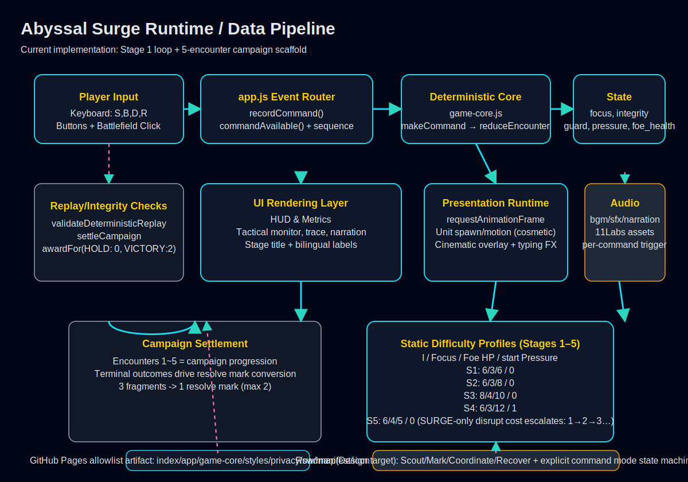

# Abyssal Surge

[](https://github.com/jellyggumi/Abyssal-Surge/actions/workflows/static.yml)
[](https://jellyggumi.github.io/Abyssal-Surge/)


## 최근 업데이트 (app.js / game-core.js 반영)

- Stage 5의 `DISRUPT`는 SURGE 회차에서 누적 비용(1→2→3…)으로 계산됩니다. (`game-core.js`)
- `game-core.js`는 스테이지/스케줄 바인딩 정합성 및 포렌식 계열 상태 위조(`forged state`, `journal`, `replay`) 방어를 강화했습니다.
- `app.js`는 입력/표시/재개 시나리오에서 허용/거부 상태의 정합적 동기화를 개선해, 거부된 제어가 canonical 상태를 변경하지 않도록 정렬했습니다.
- `app.js`는 `RECOVER` 커맨드에 대해 1초 회복 채널을 재도입해, 활성 1.5 Focus/s 회복률 창이 텔레그래프/유닛 업데이트와 동기화되며 상태 오류 없이 동작합니다.
- 정합 검증:
  - `node --check app.js`
  - `node --check game-core.js`
  - `node --test tests/game-core.test.mjs tests/stage1-vertical-slice.test.mjs tests/playtest-5-stages.test.mjs`

### 배포 산출물 allowlist (static.yml 기준)

- 배포는 다음 파일 전체를 기준으로 생성됩니다: `index.html`, `app.js`, `game-core.js`, `styles.css`, `privacy.html`, `sw.js`, `manifest.json`, `icon.svg`, `assets/`

---

## 🎮 게임 소개

**Abyssal Surge**는 웹 우선으로 빌드되는 **결정론적 전술 전투 웹 게임**입니다.

현재 레포에서 실제 동작하는 핵심은 아래와 같습니다.

- 1회차 설계 목표(현재 Stage 1 규칙) 기반의 **5회 인카운터 캠페인**
- 순수 결정론 엔진 `game-core.js` + 프레젠테이션 레이어 `app.js`
- 단일 입력 경로(`recordCommand`)로 키보드/버튼/레인 클릭 처리
- `STRIKE / BRACE / DISRUPT / RECOVER` 명령군
- 스테이지별 난이도/리듬/체감 속도 차등(시뮬레이션/시각화 레이어 분리)
- 오프라인 동작을 위한 PWA(`sw.js`, `manifest.json`) + Android 포팅 전단계 준비(`apk/`)

### 전투·조작 동작(현재 적용)

- 조작: 키보드 `[S]=STRIKE`, `[B]=BRACE`, `[D]=DISRUPT`, `[R]=RECOVER` / 화면 버튼 동기화
- 전투 흐름: `encounter` 단위로 `STRIKE/BRACE/DISRUPT/RECOVER` 입력이 1초 주기(프레임 루프)와 함께 누적되고, 수치 변화는 모두 `game-core.js`의 공개 규칙 결과를 기준으로 동기화됨
- `RECOVER`는 즉시 `focus +1` 비용 0으로 시작해, **실시간 1초 회복 채널(1.5 Focus/s)** 동안 가시연출과 유닛 이동을 계속하는 동작 구간으로 동작해도 게임 규칙상 상태는 동일 판정 원칙을 유지
- 회복/차단/공격은 판정이 `ACCEPTED`일 때만 영속 상태에 기록되고, `REJECTED` 입력은 HUD/메시지 전용으로 처리 후 즉시 discard

### 의도한 게임 플레이 톤

- 매 라운드마다 의도된 위협(STRIKE/SURGE) 패턴에 맞춰 `focus`, `guard`, `pressure`를 운영하는 소규모 전술 전투
- 5개 스테이지를 캠페인 단위로 연쇄하며, 터치/터치패드 기반 웹/모바일 동작을 우선 타깃으로 튜닝


---

## 🧭 게임 규칙 개요(스냅샷)

### 1) 상태값과 액터

- 핵심 상태: `integrity`, `focus`, `guard`, `pressure`, `foe_health`
- 라운드 기반 적 행동 시퀀스: `CAMPAIGN_SCHEDULES`
- 결정론 처리 경로: `makeCommand()` → `reduceEncounter()`

### 2) 전투 커맨드

| 커맨드 | 비용(포커스) | 효과 |
|---|---:|---|
| `STRIKE` | 1 | 적 체력 `foe_health -2` |
| `BRACE` | 1 | `guard +2` (최대 2), 다음 라운드 적 STRIKE 피해 상쇄 보조 |
| `DISRUPT` | 기본 1<br/>`SURGE` 회차 차단 시 | **필요 조건:** 현재 `SURGE`일 때만 가능, 적 체력 -1, 해당 라운드 SURGE 피해/압박 무효화 |
| `DISRUPT`(스테이지 5) | 1 → 2 → 3 ... | 스테이지 5(캠페인 인덱스 4)에서 누적 사용 횟수만큼 비용 증가 (`1 + disrupt_uses`) |
| `RECOVER` | 0 | `focus +1` (상한: `focus <= 2` 제한을 통과해야 함) |

> 입력 가능성은 `commandAvailable()`에서 `makeCommand`/`reduceEncounter` 미리 실행으로 계산되어 버튼이 비활성화됩니다.

### 3) 결과 판정

- `VICTORY`: `foe_health === 0`
- `HOLD`: 마지막 예정 라운드까지 생존(패배 조건 미도달)
- `DEFEAT_INTEGRITY`: `integrity === 0`
- `DEFEAT_PRESSURE`: `pressure === 4`

### 4) 정산 규칙(캠페인)

- `awardFor(VICTORY) = 2`
- `awardFor(HOLD / DEFEAT_*) = 0`
- 5개 인카운터 종료 후 `settleCampaign()` 적용
- 3 파편당 Resolve Mark 1개 지급(최대 2개)

---

## 🗺️ 스테이지(캠페인)

### 현재 스테이지 라벨

- The Bell Beneath Blackwater / 블랙워터 아래의 종
- The Quiet Standard / 침묵의 군기
- The Shore That Remembers / 기억하는 해안
- Names Under the Foam / 물거품 속의 이름들
- The First Surge / 첫 번째 서지

### 스테이지별 기초 설정(현재 구현값)

| 인카운터 | `max_integrity` | `max_focus` | `max_foe_health` | 시작 `pressure` |
|---:|---:|---:|---:|---:|
| 1 | 6 | 3 | 6 | 0 |
| 2 | 6 | 3 | 8 | 0 |
| 3 | 8 | 4 | 10 | 0 |
| 4 | 6 | 3 | 12 | 1 |
| 5 | 6 | 4 | 5 | 0 |

> 1~3 라운드짜리 일정표(`STRIKE`/`SURGE`) 조합은 `CAMPAIGN_SCHEDULES`에서 고정됩니다.

---

## 📐 아키텍처 다이어그램



---

## 📂 프로젝트 구조

```text
Abyssal-Surge/
├── index.html          # 엔트리 HTML + 접근성 레이블
├── styles.css          # 룰/상태/레인 렌더 스타일
├── app.js              # 입력 처리, HUD/연출, 오디오, RTPS 레이어
├── game-core.js        # 순수 규칙 엔진(결정론 Reducer)
├── sw.js               # Service Worker(v3): NETWORK-FIRST 앱 업데이트 + 오프라인 미디어 캐시
├── manifest.json       # PWA 매니페스트
├── privacy.html        # 개인정보 안내
├── icon.svg            # 배포 아이콘
│
├── assets/
│   ├── icons/          # 아이콘 192/512
│   ├── images/         # 유닛/배경/단계 소개 이미지
│   ├── audio/          # SFX/BGM/Narration
│   └── video/          # 스테이지 시네마틱 영상
│
├── docs/
│   └── abyssal-surge-architecture.svg
│
├── apk/
│   ├── BUILD.md        # TWA 패키징 실행 지침
│   ├── twa-manifest.json
│   └── assetlinks-template.json
│
├── tests/
│   ├── game-core.test.mjs
│   ├── stage1-vertical-slice.test.mjs
│   ├── playtest-5-stages.test.mjs
│   ├── validate-cycle-retrospective.test.mjs
│   ├── test_workflow_state.py
│   ├── test_workflow_contract.py
│   └── playtest-browser.cjs
│
├── scripts/
│   └── validate-cycle-retrospective.py
│
└── .github/workflows/
    └── static.yml      # GitHub Pages allowlist/복원성 검사
```

---

## 🚀 실행/테스트

### 로컬 실행

```bash
python -m http.server 8000
```

브라우저에서 `http://localhost:8000` 접속

### 테스트(현재 커버하는 규칙)

```bash
node --test tests/game-core.test.mjs tests/stage1-vertical-slice.test.mjs tests/playtest-5-stages.test.mjs tests/validate-cycle-retrospective.test.mjs
python3 -m unittest tests/test_workflow_state.py tests/test_workflow_contract.py
```

### 배포 점검 포인트

- `.github/workflows/static.yml`는 정적 배포 artifact를 `index.html`, `app.js`, `game-core.js`, `styles.css`, `privacy.html`, `sw.js`, `manifest.json`, `icon.svg`, `assets/`로 구성해 Pages 업로드 전 정확성 검증
- `node --check`로 핵심 JS 문법 검사 수행

---

## 🛠️ 모바일 포팅 상태

- `apk/` 폴더에 Bubblewrap 기반 TWA 흐름 문서 제공(`apk/BUILD.md`)
- 현재 코드 기준: 웹 빌드 안정성 검증 후 로컬 Android 빌드 단계는 사용자 환경에서 수행해야 함

---

## 🗂️ Roadmap 정합성(현재 구현 대비)

- 기존 기획에서 제안한 `Scout → Mark → Coordinate → Recover` 형태는 목표 설계 단계입니다.
- 현재 public 릴리즈는 위 규칙의 **축소판 커맨드 루프**(`STRIKE/BRACE/DISRUPT/RECOVER`)로 안정화되어 있으며,
  다음 단계는 `command 모드 상태 머신`(명령 선택→대상 지정→재개)을 코드 경로에 넣어 설계 목표와 1:1 정합성으로 확장하는 것을 준비 단계로 두고 있습니다.
