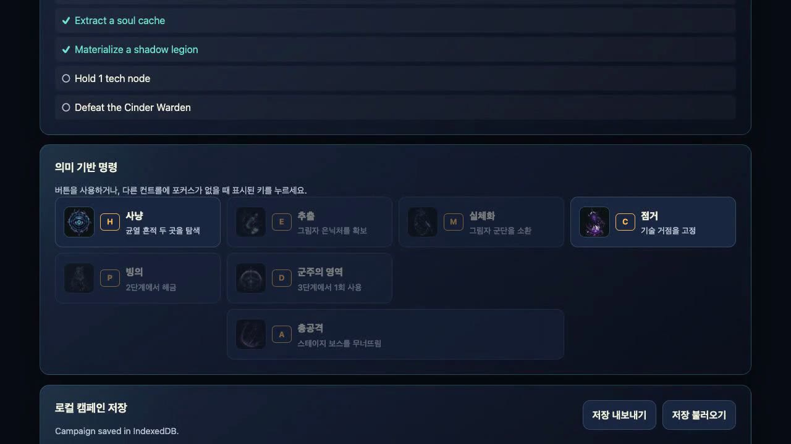

# Abyssal Command (Shadow Lord)

[](https://github.com/jellyggumi/Abyssal-Surge/actions/workflows/static.yml)
[](https://jellyggumi.github.io/Abyssal-Surge/)

**Abyssal Command**는 《나 혼자만 레벨업》 IP에서 영감을 얻은 **전투 중심 무자원 RTS-RPG 하이브리드 웹 게임**입니다.
전투 성과를 곧바로 병력(그림자 군단)과 성장으로 전환하는 결정론적 규칙 엔진 위에서, 3단계 캠페인이 게이트 검증(G1–G8)을 통과하며 사이클로 제작됩니다.

**▶ 플레이**: https://jellyggumi.github.io/Abyssal-Surge/ (모바일·데스크톱, PWA 오프라인 지원)

[**🎬 풀 캠페인 플레이 영상 (67s)**](docs/media/abyssal-surge-play.mp4)

[](docs/media/abyssal-surge-play.mp4)

---

## 🎮 게임 특징 및 시스템

1. **무자원 확장 루프 (그림자 추출)**
   * 자원 채집 노동자 없이 `사냥(H) → 추출(E) → 실체화(M)` 루프로 영혼을 병력으로 전환합니다. 루프는 반복 가능하며 군단 슬롯 상한이 경제를 바운드합니다.
   * 마력 거점(`점령 C`)으로 전장 통제권과 보스전 조건을 엽니다.
2. **시맨틱 커맨드 조작 (터치 = 키보드 동등)**
   * 7 커맨드: `H`unt / `E`xtract / `M`aterialize / `C`apture / `P`ossess / `D`omain / `A`ssault — 버튼과 단축키가 동일한 상태 전이를 호출합니다.
   * 빙의(P)는 Stage 2부터 — 돌격 피해 +1(리프트 렌즈 +2). Stage 3의 실전 선택지입니다.
3. **밸런스 v2 — 위험이 실재하는 결정론 전투**
   * 보스 반격이 스테이지별로 상승(기본 1/2/8)하고, **군단 방패** `max(1, base − ⌊legion/4⌋)`가 이를 흡수 — 병력 규모가 곧 생존입니다.
   * **integrity는 스테이지를 넘어 지속** (보상 선택 시 +1 회복). 초반 낭비가 후반을 압박합니다.
   * 얇은 군단(`legion < 2+스테이지`)의 돌격은 반격 +1 — 무모한 돌격은 Echo Throne에서 죽습니다 (실측 재현).
   * **군주의 영역(D)**: +4 integrity 회복 + 다음 반격 2회 무효(aegis), 캠페인 1회 — 검증된 일발역전기: 같은 라인이 Domain 없으면 패배, 있으면 완주.
4. **결정론적 규칙 엔진 + 위조 방지 세이브**
   * `campaign-state.js` v2: 같은 액션 시퀀스 = 같은 결과. 세이브는 이벤트 트레이스 봉투(schema v2)로 저장되고 복원 시 전체 리플레이로 검증됩니다.
   * IndexedDB 기본 + localStorage 폴백, JSON 내보내기/가져오기.
5. **연출 — 내레이션·타이핑·컨셉아트**
   * 스테이지 진입/승리/패배마다 한국어 내레이션(음성 + 타이핑 애니메이션, reduced-motion 시 즉시 표시).
   * 16종 컨셉아트 UI 스프라이트(액션 아이콘 7, 보상 카드 6, 보스 초상 3) + Blender 저폴리 기념비 엠블럼.
   * 스테이지 전환 비디오, 오로라/파티클 배경, SFX 8종.


## 단일 페이지 전투 플로우

`시나리오 브리핑 → 보스 스펙 → 2.5D 전장 → 결과/보상 → 다음 시나리오`는 URL 이동이나 새 페이지 로드 없이 `#campaign-screen` 안의 전용 뷰를 전환합니다. 패배하면 같은 흐름에서 Stage 재시도를 선택합니다.

- **버드아이 전장**: Three.js 캔버스가 아군 `Dusk Portal`, 적군 `Dread Portal`, 보스, 반복 웨이브, 충돌 스파크와 군주의 영역 돔을 한 화면에 표시합니다.
- **동시 쿨다운 전술**: 7개 커맨드는 각자 실시간 쿨다운을 갖습니다. 사용 가능 여부와 남은 시간은 Control Pad에 표시되고, 보상/아이템의 쿨다운 감소가 다음 전투의 사용 주기에 반영됩니다.
- **전장 압박**: 적이 아군 경계선을 넘으면 Aegis를 먼저 소모하고, 없으면 integrity가 감소합니다. 결과 화면은 승리 시 하나의 보상만 선택하게 하며, 선택 효과는 다음 시나리오의 능력치에 누적됩니다.
---

## 🗺️ 3단계 캠페인 구조

| Stage | 무대 | 신규 전술 | 보스 (HP) | 계승 |
|---|---|---|---|---|
| 1 | **Cinder Span** (잿빛 교량) | 추출·점령 기본 루프 | Cinder Warden (8) | 보상 1택 (`+12 슬롯` vs `빙의 강타 +1`) |
| 2 | **Veil Citadel** (장막 성채) | 빙의 해금, 거점 2개 동시 유지 | Veil Tactician (10) | 보상 1택 (`선봉 4셰이드` vs `integrity +2`) |
| 3 | **Echo Throne** (메아리 왕좌) | 군주의 영역 (일발역전) | Gate Sovereign (17) | 기록 보상 (아카이브) |

### 밸런스 검증 수치 (시뮬레이터 실측, n=200)

| 아키타입 | 캠페인 승률 | 비고 |
|---|---:|---|
| casual (랜덤 유효 액션) | **51.0%** | 목표 밴드 45–55% 내 |
| optimal (정보형 최단) | 100% (25 액션) | 완주 보장 |
| greedy-economy (만벽 요새) | 100% (56 액션) | 저위험 저속 |
| comeback (Domain 역전) | 100% (27 액션) | 동일 라인이 Domain 없으면 패배 |
| rusher (얇은 돌격) | **0%** | Echo Throne 사망 — 의도된 교훈 |

재현: `node scripts/run-campaign-balance-sim.mjs` (결정론, 2회 실행 동일 출력).

---

## 📂 프로젝트 구조

```text
Abyssal-Surge/
├── index.html            # 캠페인 UI (스토리보드·캠페인 맵·i18n)
├── styles.css            # 다크 판타지 스타일 + 타이핑/스프라이트/오로라
├── app.js                # 입력, 내레이션·타이핑 엔진, HUD, 오디오, 저장
├── campaign-state.js     # 결정론 규칙 엔진 v2 (BALANCE 노브 공개)
├── game-core.js          # 레거시 인카운터 엔진 (스탠드얼론 듀얼)
├── i18n.js               # 한국어/영어 로컬라이제이션
├── sw.js                 # PWA 서비스 워커 (캐시 v2, 전 자산 레지스트리)
├── assets/               # 오디오(내레이션 6·SFX 8), 스프라이트 16, 스토리보드, 비디오
├── apk/                  # TWA(APK) 포팅 킷 — bubblewrap 원커맨드 빌드
├── docs/                 # 디자인 문서 + 플레이 영상
├── scripts/              # 밸런스 시뮬레이터 (아키타입 5종 + 퍼저)
├── tests/                # 규칙/캠페인/브라우저 E2E 테스트
├── tools/promo-video/    # Remotion 플레이 영상 컴포지션
└── _workspace/           # game-studio-harness 생산 사이클 아티팩트 (게이트 증거)
```

## 🚀 실행 및 테스트

### 로컬 실행
```bash
python3 -m http.server 8000   # http://localhost:8000
```

### 테스트
```bash
# 규칙 엔진 + 캠페인 상태 머신 (14 테스트)
node --test tests/game-core.test.mjs tests/campaign-state.test.mjs

# 밸런스 시뮬레이션 (아키타입 5종, 퍼저 150k op, 게이트 수치 JSON)
node scripts/run-campaign-balance-sim.mjs

# UI 기반 3단계 종단 간 검증 (playwright 모듈 필요)
node tests/playtest-browser-3stage.cjs
```

### 플레이 영상 렌더 (Remotion)
```bash
cd tools/promo-video && npm install
npx remotion render src/index.ts PlayVideo out/abyssal-surge-play.mp4 \
  --props='{"gameplaySrc":"gameplay.mp4","gameplaySeconds":60.8}'
```

### APK 포팅 (TWA)
[apk/BUILD.md](apk/BUILD.md) — bubblewrap 원커맨드 킷 (JDK 17 + Android SDK 필요, Digital Asset Links 절차 포함).

---

## 🏭 제작 방식 — game-studio-harness

이 게임은 5-역할 에이전트 스튜디오(디렉터·기획·PM·프로그래머·QA)가 **기획→구현→테스트→PM 사이클**로 제작합니다:

- **수치 게이트**: G1 세계관 일관성 · G2 밸런스 밴드(45–55%) · G3 아키타입 다양성(≥3 유효) · G4 몰입(≥4.0/5) · G5 매출-밸런스 공정성 · G6 운영(perf p95 ≤16.7ms — 실측 9.2ms) · G7 코어루프(30–180s — 실측 밴드 내) · G8 참신성.
- **QA 우선**: 시뮬레이터가 v1의 "패배 불가·보상 무효" 결함(B1–B5)을 수치로 증명 → v2 리튠(8회 노브 반복, 90.5%→51.0%) → 라이브 브라우저 재검증.
- **자가발전 회고**: 단계마다 Pydantic 타입 회고 레코드(`_workspace/*/retrospectives/`)를 남기고, 미적용 개선 액션은 carry-forward 큐로 다음 단계에 강제 전달됩니다.
- 전체 증거는 [`_workspace/20260716-shadow-lord-rts-rpg/`](_workspace/20260716-shadow-lord-rts-rpg/)의 게이트 원장·밸런스 시트·익스플로잇 레지스터에 있습니다.
