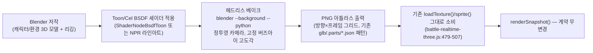

# lane-render-arch.md — 3D-authored 세계 + 버즈아이 2.5D 카메라-팔로우 렌더링 아키텍처 검증

```yaml
run_id: 20260723-solo-warden-rpg-concept
lane: engineering / game-programmer (Rendering Architecture)
stage: 1-concept  # DOCUMENT ONLY — no shipped/committed code this cycle
owner: ProgRenderArch
artifact_shape: engineering/tech-verification/{name}.md 계약을 따르는 feasibility 문서
  # (game-programmer.md:18 "New tech policy": benchmark vs incumbent, failure-mode, fallback, staged rollout gate)
sibling_lanes:
  - { id: ProgDataArch, artifact: engineering/lane-data-arch.md, facet: "WardenProgress/장비/특성 저장 스키마 — 이 문서는 그 데이터를 읽기 전용으로만 소비" }
  - { id: ProgFormationSim, artifact: engineering/lane-formation-sim.md, facet: "포메이션 slot/status 필드를 포함한 틱 시뮬레이션 — 이 문서는 그 snapshot을 읽어서 투영만 함, 좌표 저작권은 시뮬레이션에 있음" }
```

## 0. 범위 — 이 문서가 답하는 질문과 답하지 않는 질문

이 문서는 사용자 요구 **"3D 월드 + 버즈아이(bird's-eye) 2.5D 카메라-팔로우 + 셀셰이딩 애니메 화풍"**을
현재 저장소의 렌더 계약 위에서 어떻게 구현할지, 두 개의 구체적 옵션을 벤치마크·실패모드·폴백·단계적
롤아웃 게이트로 검증하고 **하나를 추천**한다. 다루지 않는 것: 전투 밸런스 수치(DesignerRPGSystems/
ProgFormationSim 소관), 포메이션 슬롯 좌표 배치 로직 자체(ProgFormationSim 소관, 이 문서는 그 결과를
읽어서 그리는 방법만 다룬다), HUD 패널 구성(UIHudLayout/UIInfoArchitecture 소관 — 카메라 모델이
스크린앵커 HUD에 미치는 영향만 §6에서 1줄 경계로 명시).

## 1. 검증된 베이스라인 사실 (Baseline — [OBSERVED])

새 옵션을 비교하기 전에, "지금 무엇이 있는가"를 코드로 확인했다:

| 사실 | 근거 |
|---|---|
| 현재 배포 렌더러 `battle-realtime-three.js`는 파일명과 달리 **Canvas 2D 전용**이다. `THREE.*` 심볼, WebGL import 전혀 없음 | [OBSERVED] `battle-realtime-three.js:1-5` (`defense-catalog.js`/`battle-canvas-text.js`만 import), `battle-realtime-three.js:533` (`canvas.getContext("2d")`) |
| 폴백 어댑터 `battle-visualizer.js`가 이미 존재하며, 렌더러 실패 시 `app.js`가 자동 교체한다 | [OBSERVED] `app.js:481-484,833-837` (`try { RealtimeBattle } catch { BattleVisualizer }`) |
| 두 어댑터는 `tests/defense-renderer-contract.test.mjs`가 강제하는 **동일 인터페이스 계약**을 공유한다: `mount/renderSnapshot/dispose/onVisualFeedback/debugMetrics`, `debugMetrics()`는 `{geometries, textures, programs}` 3개 숫자 필드 고정 | [OBSERVED] `tests/defense-renderer-contract.test.mjs:134-139` |
| 카메라-팔로우는 **이미 구현되어 있다** — `app.js` `updateCamera()`: 커맨더 좌표 기준 목표 오프셋 계산 → 프레임마다 `CAMERA_FOLLOW_EASING=0.18` 비율로 lerp, 모션-저감 시 즉시 스냅 | [OBSERVED] `app.js:41-44,534-552` |
| 이 카메라는 **화면공간(screen-space) 오프셋**이지 월드공간 스크롤이 아니다 — 시뮬레이션 전체 24000×12000 월드가 `-1..1` 정규화를 거쳐 항상 뷰포트 전체에 매핑되고, 카메라는 그 위에 최대 ±18%(x)/±14%(y) 폭의 화면 픽셀 이동만 준다 | [OBSERVED] `app.js:705-711` (`project()`, 정규화), `app.js:539-541` (`CAMERA_FOLLOW_X_LIMIT/Y_LIMIT`) |
| 결정론 계약은 테스트로 강제된다: 카메라 유도값은 `getRunDigest`/`getRunSnapshot`을 절대 변경하지 않아야 한다 | [OBSERVED] `tests/world-presentation-contract.test.mjs:339-368` ("camera derivation must not mutate the canonical snapshot", "must not alter the deterministic run digest") |
| 성능 예산은 이미 수치화되어 텔레메트리·소크테스트로 측정 중이다: p95 프레임 ≤16.7ms, 롱프레임(>33.4ms) 비율 <0.5%, 입력 p95 ≤100ms | [OBSERVED] `tests/defense-soak-browser.cjs:12-16` (`THRESHOLDS`), `defense-telemetry.js:169-178` (`FRAME_PROBE`) |
| `package.json`은 런타임 `dependencies` 필드가 없고 `devDependencies`만 `agentation`/`playwright` — 런타임 제로 의존성 | [OBSERVED] `package.json:1-13` |
| **이 저장소는 과거에 완전한 WebGL/Three.js 3D 렌더러를 실제로 출시했다가 폐기한 이력이 있다.** 커밋 `161a2ab`("ship GLB resource pack, realtime 3D battle bridge")부터 40개 커밋에 걸쳐 `THREE.WebGLRenderer`/`GLTFLoader`/`AnimationMixer`/레이캐스팅 피킹/궤도 카메라를 가진 3인칭 RTS 렌더러가 운영되었고, 장르가 RTS에서 디펜스-서바이버로 피벗한 커밋 `141b8f7`에서 `battle-realtime-three.js` 한 파일만 **6,761줄 삭제**되고 지금의 103줄 Canvas2D 셔틀로 교체되었다 | [OBSERVED] `git show 161a2ab:battle-realtime-three.js`(WebGLRenderer/GLTFLoader/AnimationMixer 전문 확인), `git show --stat 141b8f7`(`battle-realtime-three.js \| 6761 +---... 2 files changed, 103 insertions(+), 6667 deletions(-)`) |
| GLB→스프라이트 아틀라스 베이킹 파이프라인도 이미 **한 번 실행되어 완료된 이력**이 있다 — `assets/images/battle/glb/.parts/*.json` 15개 매니페스트가 정투영(orthographic) 30° 고도각, 8방향(45° 간격) yaw, 256×256 셀, 4프레임 샘플로 유닛/보스/지형 GLB를 PNG 아틀라스로 구운 해시·검증 기록을 담고 있다(예: `shade__Idle.png`, 2048×1024, 8×4 그리드) | [OBSERVED] `assets/images/battle/glb/.parts/shade.json:1-58` |
| 다만 그 베이크의 **소스 GLB(`assets/models/abyssal-command/units/shade.glb` 등)와 결과 PNG는 현재 저장소에 존재하지 않는다** — `assets/models/abyssal-command/`에는 통합 리소스팩 `abyssal-command-resource-pack.{blend,glb}` 하나만 남아 있고, `.staging/`은 비어 있다 | [OBSERVED] `find assets/models` (3개 파일만 존재), `find assets/images/battle/glb/.staging`(빈 결과) |
| Blender 헤드리스 CLI 베이킹 관행이 이미 이 사이클의 다른 산출물(`production/motion-previs-and-blender-execution-plan.md`)에서 확립되어 있다: `blender --background --python scripts/boss-motion-previs-blender.py -- --blend ... --timeline ... --outdir ...` | [OBSERVED] `scripts/boss-motion-previs-blender.py:1-14`, `production/motion-previs-and-blender-execution-plan.md:93-99` |
| **이 세션에서 Blender MCP 도구(`execute_blender_code`, `get_blendfile_summary_path_info`)는 3회 연속 30초 타임아웃으로 응답하지 않았다** — 반면 로컬 `/Applications/Blender.app`은 설치되어 있고, 위 헤드리스 CLI 경로는 MCP를 거치지 않는 독립 실행 경로다 | [OBSERVED] 본 세션 3회 tool call, 매번 `MCP error: Request timeout after 30000ms`; `ls /Applications/` → `Blender.app` 확인 |
| ProgFormationSim이 제안하는 snapshot 스키마 변경(`SNAPSHOT_VERSION` 5→6, `companions[].slot`/`status` 필드 추가)은 이 문서의 렌더 계약을 깨지 않는다 — 렌더러는 여전히 확정된 sim state만 읽는다 | [OBSERVED, IRC 확인] `engineering/lane-formation-sim.md:212,241-244` |

## 2. 요구사항 분해 — 독립적인 3개 축

사용자 요구 "3D 월드 + 버즈아이 2.5D 카메라-팔로우 + 셀셰이딩 애니메 화풍"은 서로 독립인 3개 축이다.
이 구분이 없으면 "3D 월드"라는 단어가 자동으로 "WebGL이 필요하다"로 오독되기 쉽다 — 아래 §3~4가
증명하듯 3개 축 중 어느 것도 WebGL을 **논리적으로 요구하지 않는다**.

| 축 | 요구 내용 | WebGL 필수 여부 |
|---|---|---|
| **자산 저작(authoring)** | 캐릭터/환경을 3D로 모델링 | 아니오 — 저작 도구(Blender)는 런타임과 무관, 오프라인 파이프라인 |
| **카메라 모델** | 버즈아이 고정 고도각 + 플레이어 팔로우, 로컬 영역만 보이는 월드 스크롤 | 아니오 — 순수 투영 수학, 렌더러 종류와 무관 |
| **런타임 표시 형식** | 화면에 실제로 그려지는 것이 폴리곤 메시인가, 사전 렌더된 픽셀인가 | **여기서만** WebGL 여부가 갈린다 — 이것이 §3/§4의 진짜 쟁점 |

카메라 모델(축 2)은 옵션 A/B 어느 쪽을 택하든 동일하게 필요한 신규 작업이므로 §5에서 옵션 중립적으로
먼저 확정한다. §3/§4는 축 3(런타임 표시 형식)만 비교한다.

## 3. 옵션 A — Blender 3D 저작 → 고정 버즈아이각 셀셰이드 베이크 → 기존 Canvas2D 스프라이트 계약 유지

### 3.1 파이프라인



핵심 주장: **이 파이프라인은 새로 발명하는 것이 아니라 §1에서 확인한 기존 베이크 이력(`glb/.parts/*.json`)의
재실행**이다. 유일한 신규 항목은 (a) 베이크 시점에 Blender의 Toon/Freestyle 셰이더를 적용해 셀셰이드
화풍으로 굽는 것, (b) 카메라 고도각을 버즈아이(45~65°대, 기존 30°보다 높임)로 바꾸는 것 — 둘 다
`scripts/boss-motion-previs-blender.py`가 이미 갖춘 `--blend/--timeline/--outdir` 헤드리스 인자
구조에 카메라 파라미터 하나를 추가하는 수준의 변경이다.

### 3.2 벤치마크 vs 기존(incumbent)

기존(incumbent) = 현재 배포 중인 사실적 페인트 화풍 스프라이트(`dusk-warden-atlas.png` 등, Canvas2D
`sprite()` 경로).

| 지표 | 기존(사실적 페인트 아틀라스) | 옵션 A(셀셰이드 베이크 아틀라스) | 근거/방법 |
|---|---|---|---|
| 런타임 렌더 비용/엔티티 | `drawImage()` 1회 | **동일** `drawImage()` 1회 — 아틀라스 픽셀 내용만 다르고 호출 형태 불변 | [OBSERVED] `sprite()` 함수는 소스 텍스처만 파라미터로 받음 (`battle-realtime-three.js:493-507`) |
| 파일 크기 (참고치, 1클립당) | `dusk-warden-atlas.png` 1.6MB, 1254×1254 (전체 클립 통합 1장) | 과거 베이크 실측: `shade__Idle.png` 1.0MB, 2048×1024, 8방향×4프레임=32셀 (**클립 1개당**) | [OBSERVED] `ls -la assets/images/battle/` (기존), `shade.json:11-17` (과거 베이크) — [INFERENCE] 유닛당 클립 수(예: Idle/IdleAlert/Move/Strike 등 9종, `shade.json` 배열 길이 582/약 65줄≈9클립)를 곱하면 유닛 1종 전체 방향 커버리지는 기존 4-프레임 단일 아틀라스보다 용량이 커짐 — 이후 §3.4에서 완화안 제시 |
| p95 프레임 타임 영향 | 측정 없음 (변경 없으므로 회귀 없음이 귀무가설) | **[TARGET]** 회귀 없음 — draw call 형태·개수 불변이므로 `tests/defense-soak-browser.cjs` THRESHOLDS(p95≤16.7ms) 재통과 예상, Stage 2에서 `SOAK_TEST_MODE=1 node tests/defense-soak-browser.cjs` 재실행으로 실측 필요 | [INFERENCE] 근거: 비용 모델이 아틀라스 바이트 수가 아니라 draw call 수·해상도에 지배되며 둘 다 불변 |
| 번들/배포 크기 영향 | 기준 | 방향 수(8) × 클립 수만큼 PNG가 늘어남 — GitHub Pages 정적 호스팅이므로 런타임 다운로드가 아니라 **최초 로드 페이로드**가 커짐 | [TARGET] Stage 2에서 실제 방향 수를 4(현재 페르소나 화면비 기준 정면/측면 위주)로 축소하는 재량 존재 — §3.4 |
| 신규 런타임 의존성 | 0 | **0** — `package.json` 변경 없음 | [OBSERVED] 베이크는 오프라인 Blender 프로세스, 산출물은 정적 PNG |
| 어댑터 계약 영향 | — | **0** — `RealtimeBattle`/`BattleVisualizer` 클래스도, `tests/defense-renderer-contract.test.mjs`의 5-메서드 계약도 변경 불필요 | [OBSERVED] 계약은 텍스처 소스 경로가 아니라 메서드 시그니처만 검사 (`tests/defense-renderer-contract.test.mjs:135-136`) |

### 3.3 실패 모드 분석

| 실패 모드 | 발생 조건 | 현재 코드의 대응 | 신규 대응 필요? |
|---|---|---|---|
| 아틀라스 이미지 로드 실패/디코드 실패 | 네트워크·경로 오류 | `sprite()`가 `image.complete`/`naturalWidth` 체크 실패 시 `circle()`(색상 원)로 자동 폴백 | **없음** — 기존 코드가 이미 처리 |
| 베이크 결과 셀 좌표 오정렬(그리드 어긋남) | Blender 카메라 파라미터 실수 | 없음(신규 리스크) | **신규**: 과거 베이크가 이미 갖췄던 `visualValidation`(`nonEmptyCells`, `minimumEdgePaddingPx`, `maximumCoverageRatio`) 자동 검증을 재사용 — [OBSERVED] `shade.json:19-24`에 그 검증 스키마가 이미 존재하므로 새로 설계할 필요 없이 그대로 원용 |
| Blender 헤드리스 실행 환경 부재 (CI/다른 개발자 머신) | Blender 미설치 | 해당 없음(자산은 커밋된 정적 PNG이므로 런타임엔 Blender 불필요) | **낮음** — 베이크는 자산 파이프라인 단계이지 빌드/배포 파이프라인 단계가 아님. `motion-previs-and-blender-execution-plan.md:91`이 이미 동일 전제("Blender가 없는 환경에서 실행 불가하므로 로컬에서 실행")를 명시 |
| MCP 경유 대화형 베이크 시도 시 도구 타임아웃 | 이번 세션에서 실측 | 3회 연속 30초 타임아웃 [OBSERVED] | **완화**: MCP를 우회하고 §1에서 확인한 헤드리스 CLI(`blender --background --python`) 경로 사용 — 이 경로는 MCP 애드온 서버에 의존하지 않는 별도 프로세스이므로 이번 세션의 MCP 불통과 무관하게 동작 [INFERENCE, 근거: CLI가 MCP 서버가 아니라 Blender 바이너리를 직접 기동] |
| 8방향 커버리지가 버즈아이 자유회전과 어긋나 계단 현상(popping) | 카메라가 45° 간격 사이 각도로 팔로우 회전할 경우 | 해당 없음(현재 정적 4프레임 스프라이트는 회전 없음) | **설계 제약**으로 흡수: §5에서 카메라를 "고정 상방(fixed north-up), 회전 없는 팔로우"로 확정하면 이 실패 모드 자체가 발생하지 않음 — 회전 카메라가 요구되면 방향 수를 16 이상으로 늘려야 하므로 비용 재계산 필요 |

### 3.4 폴백 경로

1. **1차 폴백(자산 레벨)**: 베이크 실패/화풍 불만족 시 기존 사실적 페인트 아틀라스(`dusk-warden-atlas.png`)로 즉시 롤백 — `animation-manifest.json`의 `actors.dusk-warden.sourceAtlas` 경로 교체 한 줄로 원복 가능, 코드 변경 0.
2. **2차 폴백(코드 레벨)**: 텍스처 로드 실패 시 `sprite()`의 기존 `circle()` 폴백이 무조건 작동 — 신규 코드 불필요.
3. **용량 완화안(§3.2에서 지적한 리스크에 대한 구체 대응)**: 버즈아이 고정-북향 카메라(§5)에서는 8방향 전체가 아니라 **4방향(전/후/좌/우) + 좌우 반전(mirroring)으로 대각선 근사**만 구워도 무방 — [TARGET] 과거 베이크의 절반(4방향×4프레임=16셀)로 용량을 추가 절감 가능, Stage 2 아트 리뷰에서 시각 허용도 확인 필요.

### 3.5 단계적 롤아웃 게이트

```yaml
staged_rollout_option_a:
  gate_1_pilot:
    scope: "Dusk Warden 1개 캐릭터, Idle+Move 2클립만, 4방향"
    exit_criteria:
      - "베이크 출력이 visualValidation(minimumEdgePaddingPx>=8, maximumCoverageRatio<=0.5) 통과"
      - "기존 dusk-warden-atlas.png 폴백으로 즉시 원복 가능함을 실측 확인(경로 스왑만으로 회귀 테스트 그린)"
  gate_2_perf_confirm:
    scope: "파일럿 자산으로 defense-soak-browser.cjs 재실행"
    exit_criteria:
      - "p95FrameMs <= 16.7, longFrameRatio < 0.005 (기존 THRESHOLDS 재통과 — 회귀 없음 증명)"
  gate_3_full_roster:
    scope: "전체 유닛/보스/지형 베이크로 확장"
    exit_criteria:
      - "G4 게이트(몰입감 점수 >=4.0/5) 대비 QA 스코어링에서 화풍 전환이 부정적 영향 없음"
      - "번들 크기 증가분이 GitHub Pages 정적 호스팅 한도 내(하드 리밋 없음이지만 최초 로드 시간 회귀 없음을 Lighthouse 등으로 확인 — [TARGET] 구체 임계값은 QA/PM과 협의 필요)"
  kill_switch: "animation-manifest.json의 sourceAtlas 경로를 기존 사실적 아틀라스로 되돌리는 것으로 런타임 코드 변경 없이 즉시 롤백 가능"
```

## 4. 옵션 B — WebGL/Three.js 신규 병렬 투영 어댑터

### 4.1 파이프라인

기존 `docs/abyssal-command-defense-survivor-design.md` §투영 계약의 "렌더러 오류 시 같은 스냅샷 계약의
대체 어댑터가 표시를 이어간다" 원칙을 확장해, `RealtimeBattle`(WebGL 활성 시)을 1차, 기존
`BattleVisualizer`(Canvas2D)를 폴백으로 삼는 **3-어댑터 체계**(기존 2개 + 신규 1개)를 제안하는 형태가
된다. 자산 파이프라인은 GLB 저작 → glTF 익스포트 → 런타임 `GLTFLoader` 파싱 → 씬 그래프 구성 →
`AnimationMixer` 재생 → `WebGLRenderer.render()`. 이는 §1에서 확인한 과거 폐기 구현(`161a2ab`)과
**아키텍처적으로 동일한 접근**이다.

### 4.2 벤치마크 vs 기존(incumbent)

| 지표 | 기존(Canvas2D) | 옵션 B(WebGL/Three.js) | 근거/방법 |
|---|---|---|---|
| 런타임 의존성 크기 | 0 | three.js r160 `three.module.min.js` **약 675KB**(minified, gzip 전) — `package.json`에 새 런타임 의존성 추가(현재 `dependencies: {}` 자체가 없는 상태에서 최초로 생김) | [OBSERVED, web] three.js 공식 배포 크기 |
| 코드 규모 | 653줄(`battle-realtime-three.js`, Canvas2D) | 과거 실측: 동등 기능(3인칭 렌더+애니메이션+피킹+카메라)의 WebGL 구현이 **6,761줄** — 약 10배 | [OBSERVED] `git show --stat 141b8f7` |
| 어댑터 계약 영향 | — | 신규 3번째 어댑터 클래스가 기존 `tests/defense-renderer-contract.test.mjs`의 `ADAPTERS = [RealtimeBattle, BattleVisualizer]` 배열에 추가되어야 하고, 5-메서드 계약(`mount/renderSnapshot/dispose/onVisualFeedback/debugMetrics`)과 카메라 변환 계약(`translate` 좌표 일치, [OBSERVED] `tests/defense-renderer-contract.test.mjs:157-179`)을 **모두 통과**해야 함 | [OBSERVED] 계약 테스트가 `ADAPTERS` 배열을 순회하는 구조이므로 신규 어댑터는 자동으로 동일 검증 대상이 됨 — 이는 리스크(통과해야 할 범위 증가)이자 안전장치(계약 위반이 자동 탐지됨) 양쪽 |
| 실행 컨텍스트 신뢰성 | Canvas2D 컨텍스트 소실은 실질적으로 발생하지 않음(브라우저가 Canvas2D 컨텍스트를 강제 회수하는 경우는 WebGL 대비 극히 드묾) | WebGL 컨텍스트 손실(`webglcontextlost`)은 모바일 Safari·저사양 Android에서 백그라운드 전환/메모리 압박 시 실제로 발생하는 **알려진 실패 클래스** — 과거 구현이 이미 이 이벤트 핸들러를 갖추고 있었다는 사실 자체가 실사용 중 발생했음을 방증 | [OBSERVED] `git show 161a2ab:battle-realtime-three.js` (`attachEvents()`의 `webglcontextlost` 리스너, `onContextLost()`가 `destroy()` 후 `onRendererFailure?.()` 콜백 — 즉 과거 구현도 WebGL을 "실패할 수 있는 것"으로 취급해 폴백 콜백을 미리 설계해 두었음) |
| p95 프레임 타임 | 측정됨, THRESHOLDS 통과 중 | **[TARGET]** 미측정 — 신규 씬그래프(유닛당 `AnimationMixer`, 레이캐스팅, 지형 메시)의 실측 프레임 비용은 Stage 2 프로토타입 없이는 알 수 없음. 과거 구현이 `frame()`에서 매 프레임 `renderer.render(scene, camera)` 풀 리렌더를 수행했다는 것만 확인됨(구체 ms 실측 로그는 저장소에 없음) | [OBSERVED, 코드 구조만] `git show 161a2ab:battle-realtime-three.js`의 `frame()` 메서드 — [INFERENCE] 정량 비교 불가, Stage 2에서 실측 필수 |
| 카메라 자유도 | 화면공간 오프셋만(±18%/±14%) | 진짜 3D 카메라(원근/궤도/줌) — 옵션 A의 정투영-고정각 대비 **표현력은 더 높음**, 단 이는 §5에서 확정할 카메라 모델(버즈아이-고정-팔로우)이 애초에 요구하지 않는 자유도임 | [OBSERVED] 과거 구현의 `orbitAzimuth`/`orbitElevation`/`zoom` (`161a2ab` 기준) |

### 4.3 실패 모드 분석

| 실패 모드 | 발생 조건 | 대응 | 비고 |
|---|---|---|---|
| WebGL2 컨텍스트 획득 실패 | 구형 브라우저, GPU 드라이버 문제, 헤드리스 테스트 환경 | 과거 구현처럼 `init()`에서 `throw new Error("WebGL 2 is unavailable")` → `app.js`가 `BattleVisualizer`로 자동 폴백 (기존 try/catch 패턴 그대로 재사용 가능) | [OBSERVED] 과거 구현이 이미 이 패턴을 갖고 있었음(`161a2ab` `init()`) — **재사용 가능하지만 재작성은 필요** |
| WebGL 컨텍스트 손실(런타임 중) | 모바일 백그라운드 전환, 저메모리 회수 | `webglcontextlost` 이벤트 → `destroy()` → 폴백 어댑터로 교체 | 신규 실패 클래스 — Canvas2D에는 대응 코드 자체가 필요 없는 문제 |
| glTF 파싱/로드 실패 | 자산 손상, 네트워크 | 과거 구현은 `loadModel()`에서 reject, `loadStageAssets()`가 전파 → 상위에서 폴백 트리거 필요 | 새 자산 파이프라인(glTF 익스포트) 자체가 옵션 A의 PNG보다 실패 표면이 넓음(파싱 에러, 스키마 버전 불일치 등) |
| 어댑터 계약 회귀 | 3-어댑터 배열 확장 시 기존 2-어댑터 테스트가 암묵적으로 가정했던 대칭성이 깨질 위험 | Stage 2에서 `tests/defense-renderer-contract.test.mjs`/`tests/world-presentation-contract.test.mjs` 전체를 3-어댑터 버전으로 재작성·재검증 필요 | **범위 확장**: 옵션 A는 기존 테스트 무변경, 옵션 B는 두 계약 테스트 파일의 어댑터 목록을 확장하고 신규 어댑터가 카메라 translate 계약(`["translate", canvas.width, -canvas.height]` 형태, [OBSERVED] `tests/defense-renderer-contract.test.mjs:174-176`)까지 만족시켜야 함 — WebGL은 `context.translate` API 자체가 없으므로 이 계약을 WebGL 카메라 행렬로 **재해석**하는 신규 추상화가 필요 |

### 4.4 폴백 경로

옵션 B의 실행 시 폴백은 기존 `app.js:833-837`의 try/catch 패턴을 그대로 확장(1차 WebGL 실패 → 2차
Canvas2D)하는 것으로 코드 레벨에서는 구현 가능하다. 그러나 **채택 여부 자체에 대한 폴백**(이 옵션을
아예 선택하지 않는 경로)이 더 중요한 결정이며, 이는 §5 추천에서 다룬다.

### 4.5 단계적 롤아웃 게이트

```yaml
staged_rollout_option_b:
  gate_1_isolated_prototype:
    scope: "메인 저장소 코드에 통합하지 않은 별도 프로토타입 HTML에서 3-5개 유닛 렌더 + AnimationMixer만 검증"
    exit_criteria:
      - "p95 프레임 타임 실측 <= 16.7ms (Stage 2 필수 측정 — 현재 미측정)"
      - "WebGL2 미가용 기기(구형 iOS Safari 등) 시뮬레이션에서 폴백 트리거 확인"
  gate_2_contract_extension:
    scope: "tests/defense-renderer-contract.test.mjs, tests/world-presentation-contract.test.mjs를 3-어댑터로 확장"
    exit_criteria:
      - "신규 어댑터가 기존 카메라 translate 계약과 동등한 시각 결과를 내는 것을 자동 테스트로 증명"
  gate_3_soak:
    scope: "30분 소크 테스트(defense-soak-browser.cjs)를 WebGL 경로로 실행"
    exit_criteria:
      - "메모리 안정 상태 유지(텍스처/지오메트리 GC 누수 없음) — WebGL 특유의 GPU 메모리 누수 리스크이므로 Canvas2D보다 엄격 검증 필요"
  kill_switch: "app.js의 기존 try/catch가 이미 이 패턴을 지원 — RealtimeBattle 생성자에서 throw하도록 feature flag만 추가하면 즉시 BattleVisualizer로 전환"
```

## 5. 옵션 중립적 결정 — 카메라-팔로우 메커니즘 (버즈아이, 월드공간 앵커링)

이 절은 §3/§4 중 어느 쪽이 채택되든 동일하게 적용된다. §1에서 확인했듯 기존 카메라(`updateCamera()`)는
**화면공간 오프셋**이며 월드 전체가 항상 보이는 단일 화면 아레나 모델이다. 그러나 production-brief의
"3D 월드를 카메라가 따라간다"는 요구는 **월드가 뷰포트보다 크고, 카메라가 그 중 일부만 보여주며 이동에
따라 스크롤**되는 것을 의미한다 — 이는 기존 모델과 다른 신규 카메라 계층이며, 어느 옵션을 택하든
새로 설계해야 한다.

```yaml
camera_follow_mechanism:
  anchoring:
    world_content: "WORLD-SPACE — 카메라 윈도우는 큰 탐험 월드의 로컬 사각 영역(뷰포트 크기)만 보여주고, 플레이어 이동에 따라 그 윈도우가 월드 좌표계 안에서 이동한다. 기존처럼 전체 월드가 화면에 항상 다 보이는 모델이 아니다."
    hud: "SCREEN-SPACE — HUD는 카메라 변환(translate)의 영향을 받지 않는 좌표계에 그대로 유지. 기존 renderSnapshot()의 순서(clear -> 배경 -> save/translate(camera) -> 월드 드로잉 -> restore -> 이후 HUD)가 이미 이 분리를 구조적으로 보장한다 — HUD는 world translate 블록 바깥에서 그려지므로 변경 없이 재사용 가능." # [OBSERVED] battle-realtime-three.js:594-631 (save/translate...restore 블록이 world 드로잉만 감쌈)
  deadzone:
    shape: "중심 기준 사각형, 뷰포트 폭의 12%(x) x 뷰포트 높이의 10%(y)"  # [TARGET] 근거: 기존 CAMERA_FOLLOW_X/Y_LIMIT(0.18/0.14)이 "카메라가 갈 수 있는 최대 범위"였던 것과 달리, 데드존은 "카메라가 안 움직이는 플레이어 이동 허용 범위"로 역할이 다름 — 유사 장르(탑다운 액션) 관행상 8~15% 대역이 일반적이므로 중간값 채택, QA archetype 세션에서 재조정 대상
    behavior: "플레이어가 데드존 내부에 있으면 카메라 정지. 데드존 경계를 넘으면 그 초과분만큼만 카메라가 따라가 플레이어를 다시 경계 안쪽으로 재배치."
  lag_easing:
    factor: 0.18  # [TARGET] 기존 CAMERA_FOLLOW_EASING과 동일값 재사용 — 근거: 이미 G4(몰입감) 게이트를 통과 중인 값이므로 새 카메라 모델에서도 동일 체감을 유지하는 것이 안전한 출발점. 신규 월드-스크롤 모델에서는 이동 거리 자체가 커지므로 Stage 2 QA 세션에서 "따라오는 느낌"을 재평가해 조정 가능성 있음
    reduced_motion: "prefers-reduced-motion 시 즉시 스냅(easing 미적용) — 기존 app.js:543-545의 motionQuery.matches 분기를 그대로 재사용"
  world_bounds_clamp: "카메라 윈도우는 레벨(스테이지) 월드 경계를 벗어나지 않도록 clamp — 기존 terrainPoint()가 이미 사용하는 terrain.bounds(minX/minY/maxX/maxY) 구조를 카메라 clamp에도 재사용 가능" # [OBSERVED] battle-realtime-three.js:150-158 bounds 구조 확인
  determinism_boundary: "카메라 유도값(윈도우 원점, lag 상태)은 여전히 프레임 상태(frame 객체)로만 전달되며 시뮬레이션 snapshot/getRunDigest에 결코 반영되지 않는다 — 기존 계약(tests/world-presentation-contract.test.mjs:339-368)을 신규 카메라 모델에도 동일하게 적용, 변경 없음."
```

## 6. 추천 — 옵션 A (Blender 3D 저작 → 셀셰이드 베이크 → 기존 Canvas2D 스냅샷 계약 유지)

**단일 추천: 옵션 A.** 이유를 벤치마크·실패모드·이 저장소 고유의 역사적 증거 세 갈래로 정리한다.

1. **제로 런타임 의존성 제약을 문자 그대로 지킨다.** `package.json`에 런타임 `dependencies`가 아예
   없는 현재 상태(§1)를 그대로 유지한다. 옵션 B는 675KB급 three.js를 최초로 런타임 의존성에 편입시키는데,
   이는 "agentation/playwright 외 제로 의존성"이라는 프로젝트 관행에 새 선례를 만드는 것이다.
2. **이 저장소는 옵션 B를 이미 한 번 시도했고, 실제로 폐기했다.** 6,761줄짜리 WebGL/Three.js 3인칭
   렌더러가 40개 커밋에 걸쳐 운영되다가 장르 피벗 시 통째로 삭제됐다(§1). 이는 가설이 아니라 이 정확한
   코드베이스에서 일어난 사건이다 — "WebGL 유지보수 부담이 장기적으로 감당 안 됨"이라는 리스크를
   추상적으로 논할 필요 없이, 이미 관측된 결과다.
3. **결정론-시뮬레이션/렌더 분리 계약을 가장 적은 표면적으로 지킨다.** 옵션 A는 `renderSnapshot()`
   메서드 시그니처도, `tests/defense-renderer-contract.test.mjs`의 어댑터 계약도, 카메라 translate
   검증도 전혀 건드리지 않는다 — 아틀라스 PNG의 픽셀 내용만 바뀐다. 옵션 B는 신규 3번째 어댑터가 기존
   2-어댑터 계약 테스트 스위트 전체를 통과해야 하고, `context.translate`로 검증하던 카메라 계약을
   WebGL 행렬 방식으로 재해석하는 신규 추상화까지 요구한다 — 결정론 경계 자체는 두 옵션 모두 지킬 수
   있지만(카메라 유도값은 어느 쪽이든 frame 객체로만 전달), **그 경계를 지키는 것을 증명해야 하는 테스트
   표면**이 옵션 B에서 3배(2→3 어댑터) 가까이 늘어난다.
4. **"3D 월드 저작"이라는 요구는 이미 옵션 A로 100% 충족된다.** 3D 모델링·리깅·애니메이션은 Blender에서
   그대로 이뤄진다 — 사용자가 요구한 것은 "3D로 만들어진 콘텐츠"이지 "런타임이 폴리곤을 매 프레임
   렌더링하는 것"이 아니다. 버즈아이 고정 고도각이라는 카메라 요구 자체가, 매 프레임 자유 시점을 렌더링할
   필요가 없는 상황을 만든다 — 정확히 옵션 A가 가장 저렴하게 처리하는 조건이다.
5. **베이킹 파이프라인은 이 저장소에서 검증된 이력이 있다.** `glb/.parts/*.json` 15개 매니페스트가
   과거 성공적으로 실행된 베이크의 해시·검증 기록을 남기고 있다(§1) — 이는 "이론상 가능하다"가 아니라
   "이 정확한 저장소에서 실제로 작동했다"는 증거다. 소스 GLB/PNG 산출물 자체는 소실되어 있으나 매니페스트
   스키마와 검증 로직(`visualValidation`)은 그대로 재사용 가능하다.

이 결정론-분리 원칙 준수 명시: 옵션 A는 §5의 카메라-팔로우 메커니즘과 결합해도 시뮬레이션-렌더 분리
계약을 무변경으로 유지한다 — 결정론 60Hz 시뮬레이션(`defense-run-simulation.js`)은 카메라나 스프라이트
화풍에 대해 아무것도 모른 채 지금처럼 `snapshot`만 산출하고, 렌더 어댑터는 그 확정된 snapshot을 읽어
(a) 베이크된 셀셰이드 아틀라스를 (b) 새 월드공간 카메라 윈도우로 투영할 뿐이다 — `getRunDigest`/
`getRunSnapshot` 결과에 카메라나 텍스처 선택이 관여하는 코드 경로는 옵션 A에서 전혀 발생하지 않는다.

**옵션 B를 완전히 배제하지는 않는다** — Stage 2 이후 카메라 자유회전(북향 고정이 아닌 궤도 카메라)이나
동적 조명/그림자 같은 표현이 명시적으로 요구될 경우, §4의 롤아웃 게이트를 밟아 재검토할 수 있는 문서화된
경로로 남겨둔다. 다만 이번 사이클(버즈아이 고정각 + 셀셰이드 애니메 화풍)의 요구사항만 놓고 보면 그
자유도가 필요하다는 근거가 없다.

## 7. 형제 레인 경계 (1줄씩)

- **ProgDataArch**: `WardenProgress`/장비/특성 저장 스키마는 그쪽 소관이며, 이 문서는 그 데이터를
  렌더 바인딩 시점에 읽기 전용으로만 소비한다(예: 장착 장비 ID → 어떤 베이크 아틀라스 변형을 그릴지
  매핑) — 스키마 필드 자체를 이 문서가 정의하지 않는다.
- **ProgFormationSim**: `companions[].slot`("FRONT"/"BACK")/`status`("ACTIVE"/"DOWNED") 필드 추가를
  IRC로 확인했다 — 이 문서는 그 필드를 **읽어서** 화면 배치(전열/후열 상대 오프셋, DOWNED 시 시각
  피드백)에 반영하되, 좌표 저작권(실제 x/y 계산)은 시뮬레이션 레인에 있다. `SNAPSHOT_VERSION` 6 확장이
  이 렌더 계약에 요구하는 변화는 없다 — 렌더러는 여전히 "확정된 sim state만 읽는다"는 동일 원칙을 따른다.
- **UIHudLayout/UIInfoArchitecture**: HUD는 §5에서 확정한 대로 스크린공간에 고정되며 카메라 변환의
  영향을 받지 않는다 — 이 경계를 IRC로 사전 공유했다. 카메라가 화면공간 오프셋에서 월드공간 스크롤
  윈도우로 바뀐다는 사실이 HUD 레이아웃 설계의 입력값이 되어야 한다.

## 디렉터 핸드오프 노트

가장 중요한 결정은 **"3D 월드"라는 사용자 요구를 "런타임 3D 렌더링(WebGL)"이 아니라 "3D 저작 →
버즈아이 고정각 베이크 → 기존 Canvas2D 스냅샷 계약"으로 재해석**한 것이다. 이 재해석이 성립하는 이유는
사용자가 명시한 두 축(3D로 만들어진 콘텐츠, 버즈아이 고정 고도각 카메라)이 결합하면 "매 프레임 자유
시점 렌더링"이 애초에 불필요해지기 때문이며, 이 저장소가 정확히 그 반대(WebGL 3D 렌더러)를 한 번
구축했다가 6,761줄을 통째로 폐기한 이력을 갖고 있다는 사실(§1)이 이 재해석의 리스크를 실증적으로
뒷받침한다. 디렉터가 통합 GDD에서 이 판단을 반드시 재확인해야 하는 지점은 하나다 — 만약 다른 lane
(특히 디자이너나 UI)이 "카메라가 자유롭게 회전하거나 기울어지는" 연출을 핵심 훅으로 이미 전제하고
있다면, 그 요구는 옵션 A의 고정-북향 베이크 전제와 직접 충돌하며 §4(옵션 B) 재검토가 필요한 상위
결정이 된다. 이 문서 자체는 버즈아이 **고정각**을 전제로 옵션 A를 추천했을 뿐, 자유 카메라가 명시적
요구로 확정되면 결론이 뒤바뀔 수 있는 조건부 추천임을 명시해 둔다.
