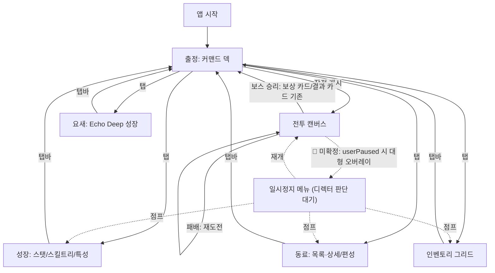

# UI 정보구조 — Solo Warden RPG 레이어 (Lane: UIInfoArchitecture)

역할: `ui-senior-developer` (Core Responsibility #1, information architecture).
결과물 경로: `_workspace/20260723-solo-warden-rpg-concept/ui/lane-info-architecture.md`.
병렬 형제 레인: `UIHudLayout`(`ui/lane-hud-layout.md`), `UIAccessibilityPerf`(`ui/lane-accessibility-perf.md`) — 경계는
문서 하단 "형제 레인 경계" 절 참고. `DesignerRPGSystems`(스탯/스킬/인벤토리/특성 수치 정의)는 병렬 실행 중이라
아직 읽을 수 없으므로, 이 문서의 모든 시스템 트레이스는 **[INFERENCE]**로 명시한 가정이다. 확정 수치는
디렉터 합류 단계에서 `design/balance-sheet.md` 대비 재검증 필요.

## 0. 기존 화면 베이스라인 [OBSERVED]

현재 배포 코드(`app.js`, `index.html`, `docs/abyssal-command-defense-survivor-design.md`)에 이미 존재하는
화면은 둘뿐이다. 새 RPG 레이어는 이 둘을 대체하지 않고 **확장**한다.

| 화면 | 성격 | 근거 |
|---|---|---|
| **커맨드 덱(로비)** | 전투 밖 풀스크린 허브. 스테이지 선택 레일 + 브리핑 패널 + 동료 편성(`loadout-slots`/`companion-grid`) + 기록실 보상(`archive-panel`) + 기록 관리(내보내기/가져오기/리셋) | `app.js:245-376` `renderLobby()` |
| **전투 캔버스** | full-bleed Canvas, 가장자리 HUD만 허용(상단 `hud-mission`+`skill-actions`, 하단 `gate-panel`+이동 컨트롤+`battle-actions`). 중앙 패널로 적/투사체/위험 영역을 덮지 않음 | `docs/abyssal-command-defense-survivor-design.md:9` "전장은 full-bleed 모바일 Canvas로 표시한다... 적·투사체·위험 영역을 덮는 중앙 패널은 사용하지 않는다"; HUD 마크업 `app.js:396-413` |

전투 중 "선택이 필요한 순간"조차 이미 **가장자리 카드(edge-card) 패턴**으로 처리된다 — 중앙 모달이 아니다:
- 보상 선택 카드: `#defense-edge-hud`에 append되는 `.edge-card.defense-reward` (`app.js:955-969`)
- 승패 결과 카드: 같은 `#defense-edge-hud`에 append되는 `.edge-card.defense-result` (`app.js:978-996`)
- 정예 추출: 하단 HUD 버튼 1개(`#extract-elite`, 컨텍스트 등장) (`app.js:923-941`)

이 edge-card 패턴이 이번 RPG 레이어의 in-battle 마이크로패널 설계 기준선이다 — 새 마이크로패널은 전부 이 패턴을 재사용한다.

## 1. DesignerRPGSystems 가정 시스템 목록 [INFERENCE]

병렬 실행 중이라 실제 산출물을 읽을 수 없다. 아래는 production-brief/shared-reference-bundle의
소스 원칙(Solo Leveling 유일성장, Kingshot 거점·영웅·편성, 로그라이크 스탯/인벤토리/스킬트리/특성)에서
역산한 **가정**이며, 모든 화면 트레이스는 이 가정에 걸려 있다. 디렉터 합류 시 재검증 요구.

| 가정 시스템 ID | 가정 내용 | 근거 |
|---|---|---|
| `warden-permanent-stat` | Dusk Warden 전용 영구 스탯(코어 스탯 + 파생 전투 스탯), 런 스코프 스킬 제안과 별도 상태 | Solo Leveling "유일하게 성장하는 주인공" 원칙 (bundle §Source 1) |
| `warden-skill-tree` | Warden 전용 영구 패시브 트리 + 액티브 로드아웃. 트리 해금은 **기존** 런 스코프 스킬 제안 풀(`SKILLS`, `app.js:880`)을 넓히는 게이트 역할만 함 — 기존 제안 카드를 대체하지 않음 | brief main_question (c) 로그라이크 스킬트리 깊이 |
| `warden-trait` | 소규모 특성/퍼크 슬롯(가정 3-4슬롯), 캠페인 마일스톤으로 해금 | RPG 장르 어휘 "역할군/특성" (bundle §Source 3) |
| `companion-growth` | 동료별 영구 스탯+장비+스킬 로드아웃 (Kingshot 영웅 모델: 역할/스킬킷이 샤드·XP·장비·스킬재료로 성장) | bundle §Source 2 "Heroes" |
| `formation-row` | 동료를 전열/후열에 배치(Kingshot exploration formation 대응) | bundle §Source 2 "Exploration" |
| `inventory-item-grade` | 장비/아이템 등급 인벤토리, Warden/동료에 장착 | RPG 장르 어휘 "인벤토리/아이템 등급" (bundle §Source 3) |
| `stronghold-growth` | Echo Deep 거점 레벨 + 병렬 성장 시설 슬롯(Kingshot town/keep growth 대응), 기존 `archive-panel` 확장 | bundle §Source 2 "Town/keep growth" |
| `rally-assault` | 다중 동료가 보스/강적 하나에 합류하는 공세(Kingshot rally 대응) | bundle §Source 2 "Rally" |

## 2. 화면/패널 인벤토리 (핵심 산출물)

전부 9개 신규/확장 화면 + 3개 신규 in-battle 마이크로패널 + 1개 **적색 플래그** 항목(3절 참고).
분류 축은 셋: **오프배틀 풀스크린**(전투 캔버스가 없는 커맨드 덱 하위 화면 — HUD 규칙과 무충돌),
**edge-HUD 마이크로패널**(전투 중, 가장자리 카드 패턴 재사용, 규칙 준수), **규칙 위반 후보**(전투 중 중앙을
덮음 — 반드시 디렉터 판단 필요).

### 2.1 오프배틀 — 커맨드 덱 하위 화면 (신규 탭 구조 제안)

기존 커맨드 덱은 단일 페이지에 모든 섹션을 나열한다(`app.js:259-313`). RPG 레이어가 6개 신규 시스템을
더하면 같은 방식으로는 스크롤 폭발 + 정보밀도 초과가 확실하므로, **탭 셸(shell) 구조로 승격**할 것을
제안한다: 상단 탭바 5개(출정/성장/동료/인벤토리/요새), 각 탭 안에 세그먼트(2차 네비)로 세분.
이 구조 자체가 이번 레인의 핵심 설계 결정이다(디렉터 핸드오프 참고).

| # | 화면 (탭 › 세그먼트) | 트레이스 시스템 [INFERENCE 근거] | 분류 | 진입 트리거 | 이탈 트리거 |
|---|---|---|---|---|---|
| 1 | **출정** — 스테이지 선택/브리핑 (기존 유지) | 기존 `campaign-state.js` + `formation-row`(편성 준비 요약 카드 추가) | 오프배틀 풀스크린 | 앱 시작 / 전투 종료 후 복귀 / 탭 클릭 | "작전 개시" → 전투 캔버스 진입 |
| 2 | **성장 › 스탯 시트** | `warden-permanent-stat` | 오프배틀 풀스크린 | 성장 탭(기본 세그먼트) | 세그먼트 전환 / 탭바 |
| 3 | **성장 › 스킬 트리/로드아웃** | `warden-skill-tree` | 오프배틀 풀스크린 (노드 그래프는 공간 필요 → 마이크로패널 불가) | 성장 탭 › 세그먼트 | 세그먼트 전환 / 탭바 |
| 4 | **성장 › 특성** | `warden-trait` | 오프배틀 풀스크린 (동일 셸 공유, 슬롯 그리드 자체는 소형이나 성장 탭에 묶어 발견성 확보) | 성장 탭 › 세그먼트 | 세그먼트 전환 / 탭바 |
| 5 | **동료 › 목록/상세** | `companion-growth` (기존 `companion-card` 확장 — 영구 스탯 배지 추가 후 탭하면 상세 드릴다운) | 오프배틀 풀스크린 | 동료 탭(기본 세그먼트) | 상세→목록 뒤로가기 / 탭바 |
| 6 | **동료 › 편성** | `formation-row` (기존 3슬롯 `loadout-slots`를 전열/후열 그리드로 확장) | 오프배틀 풀스크린 | 동료 탭 › 편성 세그먼트 | 세그먼트 전환 / 탭바 |
| 7 | **인벤토리 그리드** | `inventory-item-grade` | 오프배틀 풀스크린 (필터/정렬 포함, 밀도상 마이크로패널 불가) | 인벤토리 탭 | 탭바 / 장착 대상 선택 후 자동 복귀 |
| 8 | **요새 (Echo Deep 성장)** | `stronghold-growth` (기존 `archive-panel`/`idle-return-summary` 확장) | 오프배틀 풀스크린 | 요새 탭 | 탭바 |

### 2.2 In-battle — edge-HUD 마이크로패널 (신규, 규칙 준수)

기존 edge-card 패턴(`#defense-edge-hud`)을 재사용하는 비차단(non-blocking) 알림/버튼. 시뮬레이션을
멈추지 않고, 중앙을 덮지 않는다.

| # | 패널 | 트레이스 시스템 | 분류 | 진입 트리거 | 이탈 트리거 |
|---|---|---|---|---|---|
| 9 | **레벨업 토스트** — "LV UP" + 1줄 스탯 델타 | `warden-permanent-stat` (2번 화면의 압축 투영) | edge-HUD 마이크로패널 (기존 `.edge-card` 재사용, 하단 앵커) | 영구 XP 획득 이벤트(가정: 보스 처치 시 지급) | 자동 페이드아웃 또는 탭 즉시 닫힘, 페이즈 멈추지 않음 |
| 10 | **총공세(Rally) 트리거 버튼** | `rally-assault` + 6번 화면(편성) | edge-HUD 마이크로패널 (기존 `#extract-elite` 버튼 패턴 확장, 하단 `battle-actions`) | 컨텍스트: 보스 등장 + 편성 가능 동료 ≥2 | 탭하여 인라인 확정, 별도 화면 없음 |
| 11 | **아이템 획득 토스트** | `inventory-item-grade` | edge-HUD 마이크로패널 (기존 `.edge-card` 재사용) | 스테이지 클리어/추출 시 아이템 드롭 이벤트 | 자동 페이드아웃 또는 탭 즉시 닫힘 |

기존에 이미 존재하는 edge-HUD 요소(스킬 액션 트레이, 일시정지/추출 버튼, 보상 선택 카드, 결과 카드)는
변경 없음 — RPG 레이어가 그 패턴을 확장할 뿐 대체하지 않는다.

## 3. 🚩 규칙 위반 후보 — 디렉터 판단 필요 (침묵 위반 금지)

**#12 일시정지 메뉴 (Pause Menu)** — 현재 코드에는 일시정지 메뉴 UI가 **존재하지 않는다**. `#toggle-pause`
버튼은 `userPaused` 플래그만 토글해 시뮬레이션을 멈출 뿐(`app.js:933-938`), 캔버스는 얼어붙은 상태로
그대로 보이고 어떤 패널도 뜨지 않는다.

RPG 레이어가 늘어나면 "런 도중 빌드를 잠깐 확인하고 싶다"는 요구가 커진다(스탯 시트/인벤토리/동료 상세
빠른 조회). 이를 위한 일시정지 메뉴는 **얼어붙은 전투 캔버스 위에 중앙/대형 패널을 얹어야** 하며, 이는
기존 계약 문구 "적·투사체·위험 영역을 덮는 중앙 패널은 사용하지 않는다"(`docs/abyssal-command-defense-survivor-design.md:9`)와
문자 그대로 충돌한다.

- 내 해석 [INFERENCE, 미확정]: 이 규칙의 명시된 근거는 "위험 영역을 가리지 않는다" — 즉 **실시간 위협
  회피 가능성 보존**이 목적이다. `userPaused === true`일 때는 실시간 위협이 존재하지 않으므로(시뮬레이션
  정지), 정지 상태에서만 여는 오버레이는 규칙의 **문언은 위반하지만 취지는 위반하지 않을 수 있다**.
- 옵션 A (허용, 내 권장): `userPaused === true`일 때만 열리는 풀스크린/대형 오버레이 허용. 캔버스를
  덮어도 되며, 스탯 시트/인벤토리/동료 상세로 바로 점프하거나(점프 시 실질적으로 커맨드 덱 하위 화면으로
  전환) 읽기 전용 요약을 인라인 표시. 재개 시 오버레이 닫고 정지 해제.
- 옵션 B (불허, 문언 엄수): 일시정지 중에도 시각적 오버레이 전면 금지. "런 도중 빌드 확인" 요구는 전부
  2절의 in-battle 마이크로패널(레벨업 토스트, 획득 토스트)로만 흡수하고, 전체 화면 상세는 반드시 런을
  종료해 커맨드 덱으로 나가야만 볼 수 있음.

**이 문서는 A/B 중 어느 쪽도 채택하지 않는다.** 디렉터 결정 후 `production/decision-log.md`에 근거와
함께 기록되어야 이 화면이 8절 인벤토리에 정식 편입된다. 그 전까지 프로그래머/디자이너 레인은 일시정지
메뉴를 임의로 구현하지 말 것.

## 4. 내비게이션 맵



점선(`-.->`)은 3절에서 미확정 상태로 남긴 경로다 — 디렉터 승인 전까지 존재하지 않는 것으로 취급.

## 5. 형제 레인 경계

- **UIHudLayout** (`ui/lane-hud-layout.md`): 이 문서는 "어떤 마이크로패널이 존재하고 언제 뜨는가"까지만
  정의한다. 정확한 화면좌표/월드좌표 앵커, 카메라-팔로우 하에서의 배치, 세로/가로 잠금 시 축소 규칙은
  UIHudLayout 소유 — 예: #9~#11 마이크로패널의 정확한 anchor position은 그쪽 문서에서 확정.
- **UIAccessibilityPerf** (`ui/lane-accessibility-perf.md`): 이 문서는 화면 개수와 대략적 콘텐츠 밀도(8절
  YAML)만 보고한다. 터치 타깃/명암비/DOM 카운트/입력 지연 실측치는 UIAccessibilityPerf 소유 — 특히 탭
  구조 승격(2.1절)이 만드는 신규 DOM 서브트리 8개는 그쪽 예산 감사 대상으로 넘긴다.

## 6. 인벤토리 요약 (게이트 입력용)

```yaml
lane: UIInfoArchitecture
screens_offbattle_total: 8
screens_offbattle_tabs: 5
screens_inbattle_micropanel_new: 3
screens_inbattle_micropanel_existing_unchanged: 4
screens_flagged_unresolved: 1
rule_violation_candidates: 1          # 일시정지 메뉴, 디렉터 판단 대기
orphan_ui_count: 0                    # 전 패널이 1절 가정 시스템에 트레이스됨
navigation_depth_max: 2               # 탭 -> 세그먼트 -> (동료 상세 드릴다운만 3단계)
```

## 디렉터 핸드오프 노트

가장 먼저 판단이 필요한 결정은 **3절의 일시정지 메뉴 규칙 충돌**이다: 이 RPG 레이어가 커지면 런 도중
빌드 확인 요구가 필연적으로 생기는데, 그 요구를 풀려면 "얼어붙은 캔버스 위 오버레이 허용" 여부를
명시적으로 정해야 하고, 나는 이를 침묵 위반으로 넘기지 않고 옵션 A(정지 중에만 허용, 내 권장)/옵션
B(문언 엄수, 전부 마이크로패널로 흡수)로 갈라 디렉터 승인 대기 상태로 남겼다 — 이 결정 없이는 8절
인벤토리의 "screens_flagged_unresolved: 1"이 해소되지 않고, 프로그래머 레인이 관련 컴포넌트 계약을 쓸
수 없다. 두 번째로 중요한 결정은 커맨드 덱을 단일 페이지에서 5탭 셸 구조로 승격한 것(2.1절) — 이는
DesignerRPGSystems가 실제로 8개 미만의 하위 시스템을 확정하면 탭 통합 여지가 있고, 반대로 더 늘면
세그먼트 추가가 필요하니, 시스템 확정 산출물을 받는 대로 재검증이 필요하다.
