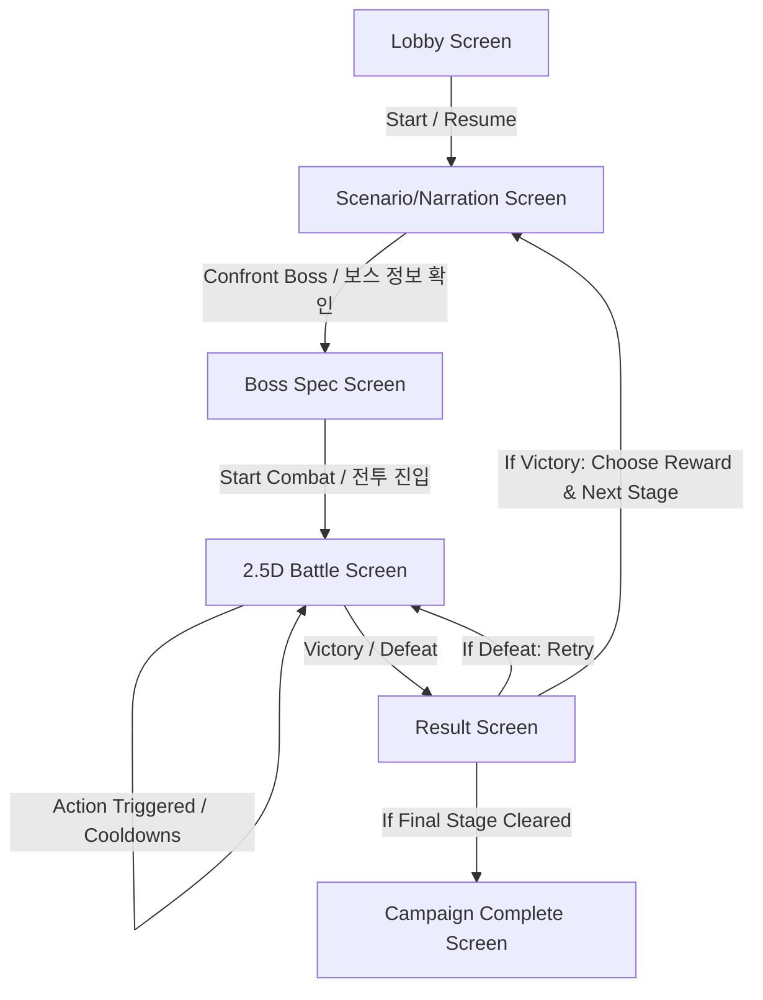

# Abyssal Surge — 2.5D Battle & SPA Screen Flow Design Spec

This document details the screen layouts, transitions, core combat loop, and reward systems for the original Abyssal Surge RTS-RPG campaign.

---

## 1. Single Page Screen Flow (SPA)
All transitions happen on a single page by managing `hidden` attributes or container classes.

### 1.1 Screen Definitions & Elements
1. **Lobby Screen (`#campaign-lobby`)**:
   - The main entry point. Shows campaign title, lede, map progression, and storyboard.
   - Options to Start Campaign or Resume Campaign.

2. **Scenario View (`#view-scenario`)**:
   - Displays the story narration with a typewriter animation.
   - Shows the stage objectives and region lore.
   - Button: `Confront Boss (보스 스펙 확인)` -> transitions to Boss Spec.

3. **Boss Spec View (`#view-boss-spec`)**:
   - Displays the Stage Boss's stats: Portrait, Name, HP (Ward strength), base damage.
   - Displays the Player's current stats (Integrity, Legion Capacity, Cooldown Reduction rate).
   - Button: `Enter Combat (전투 진입)` -> transitions to Battle Screen.

4. **Battle View (`#view-battle`)**:
   - Top area: A Canvas 2D dimetric (2:1) battlefield showing the dungeon.
     - Left: Ally base camp (Dusk Portal, active summons represented as glowing purple/cyan particles).
     - Right: Boss base camp (Dread Portal, boss presence, and spawned waves of minions).
     - Automated clash: Spawned minions and ally shades move toward each other, collide, and display combat visual effects such as impact particles and neon flashes.
   - Middle area: Health bars & Status indicators.
     - Ally Integrity (10 base).
     - Boss Ward HP (e.g. 8 / 10 / 17).
     - Active Wave (e.g. Wave 1/3, Wave 2/3, Boss Wave).
     - Souls count, Node Capture Progress bar.
   - Bottom area: Control Pad / Command Grid.
     - Buttons for Hunt, Extract, Materialize, Capture, Possess, Domain, Assault.
     - Keyboard shortcuts displayed (H, E, M, C, P, D, A).
     - Cooldown overlays: Radial/bar visual progress. While cooling down, actions are disabled.

5. **Result & Reward View (`#view-result`)**:
   - Big animated banner: "VICTORY" (neon aqua) or "DEFEAT" (faded crimson).
   - Defeat option: `Retry Stage (스테이지 재시도)` resets the active stage and returns to its Scenario view.
   - Victory option: select one exclusive reward from the current stage's offered stats/items. Stage 1 exposes capacity, possession damage, cooldown reduction, or Assault damage; Stage 2 exposes vanguard, integrity restoration, or an aegis/summon item.
   - Button: `Next Scenario (다음 시나리오)` saves progression and moves to the next stage's Scenario view.

---

## 2. Core Combat & Cooldown Loop
Instead of immediate button-mashing, actions are restricted by real-time cooldowns.

### 2.1 Default Cooldowns
- **Hunt (사냥 - H)**: 4.0s
- **Extract (추출 - E)**: 6.0s
- **Materialize (실체화 - M)**: 5.0s
- **Capture (점거 - C)**: 8.0s
- **Possess (빙의 - P)**: 10.0s
- **Domain (영역 - D)**: 15.0s
- **Assault (총공격 - A)**: 3.0s

### 2.2 Cooldown & Stat Modifications (Rewards & Items)
The campaign state persists reward-driven benefits:
- `cooldownReduction`: 20% from the Stillwater Hourglass; clamped to 50% by the state API.
- `extraAssaultDamage`: +1 from Shadebreaker Brand.
- `summonBonus` and `initialAegis`: +1 from Abyssal Banner.
- Existing capacity, possession damage, starting-vanguard, and entry-integrity rewards remain available.

### 2.3 Wave Management Rules
- Each battle begins with a 25-second command-preparation interval before the initial Scout wave spawns. Commands are intended counterplay during this pre-wave window.
- After preparation, enemies spawn from the Dread Portal every 6 seconds in a repeating three-wave cycle: Scout, Guard, and Boss Reinforcement.
- Enemy counts scale by stage: 2 scouts, then `3 + stage number` guards, then `5 + stage number` reinforcements.
- Spawned minions march toward the Ally portal. A breach consumes aegis when available; otherwise it deals 1 integrity damage and can cause defeat.
- Materialized shades march toward the boss camp, collide with minion waves, and create combat impact VFX.

---

## 3. Canvas 2D Dimetric (2:1) Combat Visualization
The top section of the battle screen uses a Canvas 2D dimetric (2:1) battlefield rather than a WebGL or Three.js scene:
- **Battlefield**: A dark, futuristic grid presentation with the Ally camp on the left and the Boss camp on the right.
- **Stage briefing**: The battle presentation supplies per-stage operation, doctrine, and force labels and the corresponding palette.
- **VFX**:
  - Spawn particles: Rising smoke/sparks when shades are materialized.
  - Conflict impact: Sparks when units collide and fight.
  - Boss shield: Glowing red forcefield that fades when nodes are captured.
  - Lord's Domain: A large dome shield covering the Ally camp when activated.
- **Canvas initialization fallback**: If Canvas initialization fails, the app displays a static tactical briefing while the command pad and logical timed-wave rules remain active.
- **Reduced motion**: The Canvas updates as static, event-driven state changes rather than through continuous animation.

### 3.1 Sprite Bake, Atlas, and Painter Contract

- **Current browser asset boundary:** Blender meshes, rigs, and generated material maps remain source-production artifacts. The shipped static client has no 3D runtime: it renders standalone pre-rendered boss PNGs and deterministic procedural unit silhouettes. A future 8-direction, 16 fps conceptual-style atlas package must be registered and validated before it replaces those silhouettes.
- **Atlas admission rule:** `validateSpriteAtlasManifest` enforces exclusive frame rectangles with a 1-pixel gutter, rejecting duplicates, partial overlaps, and edge-sharing frames. It is a production admission check today; atlas selection/loading is deliberately not claimed until an approved atlas asset is supplied.
- **Static first:** Opaque, non-occluding ground is painted into 16×16 cached chunks. This layer never enters the per-frame queue.
- **Shared depth queue:** Raised terrain, portals, nodes, units, and alpha VFX share the painter queue. Terrain uses the center of its visual tile as `sortRoot`; a mobile actor uses the center/elevation of its occupied tile. The invariant is `northwest actor < raised tile < southeast actor`, while an actor on a raised tile remains above that tile through the existing layer bias.
- **Explicit local order:** `orderInLayer` is an integer tie-breaker only after the geometric depth key. It must not replace world depth or be used as an arbitrary sorting fudge.
- **Particle roots and blend phase:** Every effect records a stable `sortRoot` at creation. Simulated particle positions never change its depth root. Additive particles draw in a final additive pass after ordinary alpha/world records; additive siblings remain ordered by their root depth and `orderInLayer`.
- **Viewport calibration:** The dimetric view derives a single scale from the current canvas bounds and projected map bounds. Camera movement, when added, must keep a continuous logical target and calibrate only the presentation transform to device pixels; it must not integer-round gameplay coordinates.

### 3.2 Per-Stage Production Review

1. Validate source provenance, atlas geometry (when an atlas is supplied), narration source text, and the current asset inventory before release registration.
2. Validate tile role assignment: floor chunks are static; only raised occluders and dynamic entities enter the shared depth queue.
3. Execute a browser playtest with a live Canvas renderer and record zero unexpected page errors plus a non-empty rendered battlefield.
4. Treat Blender, image generation, audio generation, compression, and multiplayer services as external production tools. A static GitHub Pages client may consume their exported artifacts, but must not pretend to execute them at runtime.
