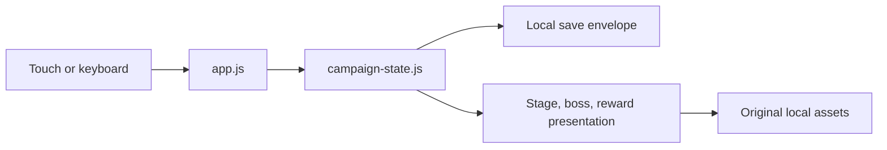

# Abyssal Surge: offline RTS-RPG campaign design

## Scope

This document describes the implemented browser campaign, not an aspirational sequel or a third-party adaptation. Abyssal Surge is original content and runs entirely in the browser. It has no multiplayer, cloud service, cross-campaign progression, or permanent reward track.

The deterministic source of truth is [`campaign-state.js`](../campaign-state.js). Presentation code must not change its combat numbers or state transitions. Player-visible stage, boss, and reward text is identified by durable `AS-WV-*` content IDs; the authoritative inventory is [worldview.md](../_workspace/20260716-shadow-lord-rts-rpg/design/worldview.md), with asset paths in [resource-manifest.md](../_workspace/20260716-shadow-lord-rts-rpg/engineering/resource-manifest.md).

## Player loop

1. Begin a local campaign at Cinder Span.
2. Hunt, extract, and materialize to create legion strength without a worker-resource economy.
3. Capture the active stage's required nodes, then assault the boss.
4. On a clear, select one currently offered reward. Its benefit belongs to the current campaign state only.
5. Advance through the three stages or retry the current stage after defeat.

The public command surface is `Hunt`, `Extract`, `Materialize`, `Capture`, `Possess`, `Domain`, and `Assault`. Touch and keyboard dispatch the same state transitions.

## Campaign stages

| Stage | Runtime ID | Goal | Boss | Deterministic HP |
|---|---|---|---|---:|
| Cinder Span | `cinder-span` | Learn hunt, extraction, materialization, and one-node capture. | Cinder Warden | 8 |
| Veil Citadel | `veil-citadel` | Maintain two signal nodes and use Possession. | Veil Tactician | 10 |
| Echo Throne | `echo-throne` | Secure the throne node and time the one-use Lord's Domain. | Gate Sovereign | 17 |

The current stage objects carry `trace.stage`, `trace.boss`, and `trace.rewards` metadata. `CONTENT_TRACE` resolves each ID to its stage, entity type, field, and exact value. Trace metadata is descriptive: it does not alter boss health, node goals, action availability, reward effects, save envelopes, or public state-machine behavior.

## Combat constraints

- Integrity carries through the active campaign and is restored only by implemented state transitions.
- Boss counter-pressure and assault damage follow the `BALANCE` values in `campaign-state.js`.
- A thin legion takes the defined additional counter-pressure on assault.
- Lord's Domain is the implemented Stage 3, one-use recovery tool; it is not a persistent upgrade.
- Reward effects are restricted to the active campaign. A completed campaign records its local result and does not create an account-level inventory.

## Browser-local architecture

The save envelope is replay-validated from its trace. IndexedDB is the primary local store and localStorage is a fallback. JSON import/export handles local data only. Cache API stores assets and is never campaign state.

## Content boundary

- Every public stage, boss, and reward name or description must resolve to an `AS-WV-*` entry.
- All public narrative, names, art, audio, and presentation are original Abyssal Surge content.
- Content that cannot be traced to the worldview inventory is not approved for runtime use.
- G1–G8 status is outside this document. A gate can be described as passed only by its own recorded audit evidence.

## Packaging boundary

The product is a static offline web campaign. Android/APK packaging is a future optional plan, not a current build artifact or delivery promise.