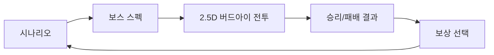

# 그림자 군주(Shadow Lord) RTS-RPG 하이브리드 — 통합 기획서

> **단일 진실 소스.** 이 문서는 4개 기획 문서를 병합한 최신본이다 (v2: 2026-07-17 방어 전투 `2f3833c` 반영).
> "확정(shipped)"은 라이브 배포에서 검증된 것, "비전(vision)"은 장기 방향이다.
> 수치의 canonical 소스는 리포지토리 `campaign-state.js`의 `BALANCE` 노브다 — 문서와 코드가 다르면 코드가 이긴다.

## 0) 한 줄 요약

**적 처치로 군단을 즉시 확장하고(무자원 루프), 영웅이 군단 전체를 통솔하는 RTS 전략감 + RPG 성장 만족의 하이브리드.** 웹/PWA 우선 → 검증 후 APK(TWA) 포팅.

## 1) 프로덕션 경계 (확정 계약)

- **릴리스 경계**: GitHub Pages 정적·오프라인·싱글플레이어. 브라우저 로컬 versioned save(IndexedDB+export/import)가 유일한 영속성. 계정/클라우드/멀티/결제/서버안티치트는 미래 게이트.
- **캠페인 모델**: 결정론 3-스테이지 캠페인 + save/replay 계약이 기준선. 서버 추상화나 미검증 풀-RTS로 대체하지 않는다.
- **권리**: 《나 혼자만 레벨업》은 *영감 레퍼런스*로만. 라이선스 증빙 없는 캐릭터명/유사 자산 생성·마케팅 금지. 신규 미디어 배치마다 자산별 출처·모델·프롬프트·SHA-256 기록.
- **검증 명령 계약**: `node --test tests/*.test.mjs`, `node scripts/run-campaign-balance-sim.mjs`, `node --check` 개별 명령이 증거 단위. npm 스크립트는 존재하지 않으므로 인용 금지 (package.json 없음 — tools/promo-video만 예외).
- **멀티플레이 마이그레이션 사다리**: P0 IndexedDB SaveEnvelope(현재) → Z1 save-envelope ghost-share 코드 공유(zero-backend, 측정: 287자/0.35ms) → 수요 검증 후 Supabase(RLS 필수) → 경쟁전은 서버 권위 런타임. 클라이언트 체크섬은 위조 방지가 아니라 손상 감지다.

## 2) 캠페인 구조 (확정, 라이브 검증)

| Stage | 무대 | 신규 전술 | 보스(HP) | 계승 |
|---|---|---|---|---|
| 1 | Cinder Span 잿빛 교량 | 사냥→추출→실체화→점령 기본 루프 | Cinder Warden (8) | 보상 1택 |
| 2 | Veil Citadel 장막 성채 | 빙의 해금, 거점 2 동시 유지 | Veil Tactician (10) | 보상 1택 |
| 3 | Echo Throne 메아리 왕좌 | 군주의 영역(일발역전, 1회) | Gate Sovereign (17) | 기록 보상 |

*수치 소스: `campaign-state.js` STAGES — `bossHealth` 8/10/17, `nodeGoal` 1/2/1.*

### 밸런스 v2 확정 수치 (시뮬레이터 + 라이브 실측)

- 보스 반격 기본 [1, 2, 8] − ⌊legion/4⌋ (하한 1) + 얇은군단(+1, legion < 2+stage). *(`campaign-state.js` counterBase/shieldDivisor/thinMargin/thinPenalty)*
- 플레이어 총공격 기본 [3, 3, 4] + 빙의 시 +1, Rift Lens 보유 빙의 시 추가 +4. *(`campaign-state.js` assaultBase/possessDamage/lensDamage)*
- integrity 스테이지 지속, 보상 선택 시 +1 (클램프 10). domain: +4 회복 + aegis 2회. *(`campaign-state.js` rewardRestore/maxIntegrity/domainRestore/domainAegis)*
- 아키타입 승률 (n=200): casual **51.0%** (밴드 45–55%), optimal 100%/25act, greedy 100%/56act, comeback 100% (domain 없으면 같은 라인이 패배), rusher **0%** (의도된 교훈).
- 콤보 EV 1.119× ≤ 1.3 — 4콤보 4결과 분화.
- **TTK 밴드 (확정)**: 스테이지 클리어 시간 목표 S1 **75s ±15%**, S2 **100s ±15%**, S3 **120s ±15%** (인간 페이스 5–15s/act × 라이브 실측 9–17act/스테이지에서 유도. 봇 실측: 7.1/8.8/9.3s @0.5s/act).
- 라이브 검증: 배포 사이트에서 47액션 풀캠페인 완주, S3를 integrity 0 직전 클리어. assault-우선 무모봇은 S2 사망(패배 도달 실증).

## 3) 전투화면 (신규 확정 — SPA 4뷰)

캠페인 전환은 한 페이지 안의 네 서브 뷰로 고정한다. URL 이동·리로드·별도 씬 파일 없음, `hidden` 토글만 사용.



- `#view-scenario` 내레이션·목표 진입점 / `#view-boss-spec` 보스 HP·반격·요구 거점 + 군주 스탯 / `#view-battle` Canvas 2D 2.5D 전장 + 컨트롤 패드 / `#view-result` 결과·단일 보상·재시도.

### 컨트롤 패드 쿨타임 (UI 페이싱 레이어)

| 행동 | 키 | 기본 쿨타임 |
|---|---:|---:|
| Hunt | H | 4s |
| Extract | E | 6s |
| Materialize | M | 5s |
| Capture | C | 8s |
| Possess | P | 10s |
| Domain | D | 15s |
| Assault | A | 3s |

성공한 행동에만 쿨타임 시작. `activeCooldown = base × (1 − cooldownReduction)`, 감소 상한 50%.
*(수치 소스: `app.js` COOLDOWN_SECONDS, `campaign-state.js` getCampaignBenefits — clamp(cooldownReduction, 0, 0.5))*
**설계 원칙**: 쿨다운은 *실시간 페이싱 레이어*일 뿐, 상태 전이는 여전히 결정론 엔진이 판정한다. 세이브 트레이스에는 행동 순서만 기록되므로 리플레이 결정론이 유지된다.

### 방어 전투(defended battle) — 2026-07-17 확정, 커밋 `2f3833c`

전투 뷰는 관전 연출이 아니라 **방어 실패가 엔진 integrity를 실제로 깎는 방어전**이다. 웨이브를 막지 못하면 breach가 세이브에 기록된다.

**웨이브 사이클** *(소스: `app.js` BATTLE_PREPARATION_MS=25_000, WAVE_GAP_MS=9_000, WAVE_LULL_MS=14_000, enemyCounts)*

```
준비 25s → 웨이브1 SCOUT → 9s → 웨이브2 GUARD → 9s → 웨이브3 BOSS REINFORCEMENT → 14s 소강(LULL 라벨) → 반복
```

- 웨이브당 적 수 `enemyCounts = [2, 2+stage, 3+stage]` — S1은 사이클당 2+3+4=9기(2HP 증원 포함 총 13스윙).
- 소강 라벨 "LULL · REINFORCE THE PICKET LINE"은 사냥→추출→실체화 경제 루프를 돌리는 창이다. 한 루프(~11s)가 셰이드 ~4기(8스윙)를 공급하므로, **경제를 계속 돌리면 방어 가능하고 방치하면 출혈로 죽는다 — 경제 정지 = 죽음은 의도된 설계다.**

**breach 소스 이원화** *(소스: `app.js` 52–58행 주석, `battle-visualizer.js` BREACH_X=1.2, `campaign-state.js` applyBattleBreach)*

| 모드 | breach 트리거 | 방어 가능? |
|---|---|---|
| 라이브 심 (기본) | 적이 Dusk Portal에 **시각적으로 도달** (x ≤ BREACH_X=1.2 → `BattleVisualizer.onEnemyBreach` → `applyBattleBreach`) | **가능** — 피켓 방어·요격·재배치로 저지 |
| reduced-motion / 렌더러 폴백 | 타이머 — 웨이브당 `⌈적 수 × SIMULATED_BREACH_RATIO(0.5)⌉`건이 BATTLE_BREACH_DELAY_MS(20s) 후 발동 | 불가 — 그래서 절반만·긴 퓨즈로 관대하게 |

- breach 판정은 엔진 소유: aegis 우선 소모 → 없으면 integrity −1 → 0이면 패배 뷰. **`battle-breach` 이벤트는 세이브 트레이스에 기록되어 리플레이가 보존된다** (`campaign-state.js` replaySaveEnvelope가 재생).

**피켓 방어 AI** *(소스: `battle-visualizer.js` PICKET_X=5.5, INTERCEPT_RANGE=3, GOAL_X=13.8, engagedT)*

- 아군 셰이드는 기본적으로 **PICKET_X=5.5 방어선**(거점 전방)에서 대기하고, **INTERCEPT_RANGE=3타일** 내 적을 자동 요격한다.
- 교전 중에는 `engagedT` 잠금으로 이동이 멈춘다 — 스윙 중 미끄러짐 없음.
- **Assault(A) 시에만** GOAL_X=13.8로 전군 돌격(속도 5.2, 이동 명령 무시). 이동 명령(클릭)을 받은 유닛은 도착 후 잠시 홀드.

**교전 리듬** *(소스: `battle-visualizer.js` CLASH_TICK_S=0.55, spawnAlly/spawnEnemy hp)*

- 스윙은 **CLASH_TICK_S=0.55s 틱** 단위 — 유닛당 틱마다 최대 1스윙이라 2HP 셰이드가 1HP 정찰 둘을 눈에 보이게 버티며 막는다(프레임 단위 증발 방지).
- 내구도: 셰이드 **2HP**(빙의 셰이드 **4HP**) / Scout **1HP** / Guard **1HP** / Reinforcement **2HP**.
- 속도: 셰이드 1.4–1.9, Scout 1.5–1.9(측면 차선 우회), Guard·Reinforcement 0.9–1.3.

**표현 전용 재배치(redeploy)** *(소스: `app.js` handleAction 937–959행)*

- 엔진 legion이 만석이라 materialize가 거부되어도, 시각 필드의 아군이 교전으로 소모되었다면(`visualizer.allies.length < stage.legion`) **M이 시각 필드만 재충원**한다. 재충원 수 = min(2+summonBonus, legion − 필드 아군 수).
- **엔진 전이 없음, 세이브 이벤트 없음, 리플레이 무영향.** 쿨타임은 동일하게 시작(페이싱 유지).

**캔버스 HUD** *(소스: `battle-visualizer.js` setHud/drawHud, 붉은 비네트 935행)*

- 좌상단 integrity 핍(채움=잔여, ≤3이면 적색 `#ff7f79`), aegis 보유 시 `AEGIS xN` 카운터, 우상단 보스 바(`BOSS n/max`).
- breach 순간 화면 가장자리 **적색 비네트 펄스** — "breach는 로그가 아니라 체감되어야 한다."

### 검증된 플레이 라인 (2026-07-17 라이브 실측)

| 라인 | 결과 | 의미 |
|---|---|---|
| S1 러시 | **14s 클리어** | 최속 경로 성립 |
| S2 빙의→총공격 | **23s 클리어** | 스테이지 메커닉(빙의) 경유 최속 |
| S3 신중(풀 군단+도메인) | **20s 클리어** | 준비된 군단의 보상 |
| S3 러시 | **9s 사망** | 얇은 군단 처벌 재현 — 의도된 교훈 |
| S2 지속 방어 | 재배치 순환으로 **150s 유지** (integrity 6/10) | 방어 경제 루프가 장기전을 지탱함을 실증 |

이 라인들은 방어 전투의 경계 검증(최속/사망/지속)이지 TTK 목표(§2, 인간 페이스 75–120s)의 대체가 아니다.

### 보상 확장 (전투화면 기획 반영)

- Stage 1: Ember Cohort(Materialize당 +2기) / Rift Lens(빙의 총공격 +4) / **Stillwater Hourglass(쿨타임 −20% + 2번째 Hunt 자동 추출)** / **Bulwark Brand(반격 −2, 하한 1 — id `shadebreaker-brand`)**.
- Stage 2: Veil Vanguard(S3를 legion 4로 시작) / Anchor Shard(S3 진입 integrity +2) / **Abyssal Banner(시작 aegis 1 + Materialize당 +1기)**.

*수치 소스: `campaign-state.js` BALANCE — cohortSummonBonus 2, lensDamage 4, hourglassCooldownReduction 0.2, brandCounterReduction 2, vanguardLegion 4, anchorRestore 2, bannerInitialAegis 1, bannerSummonBonus 1.*
- `getCampaignBenefits(state)`가 화면·전투 공유 파생 스탯의 단일 소스.

### 전장 구현 (2026-07-17 확정 — 2:1 이등각 아키텍처)

전투 뷰는 기술 보고서(2.5D RTS 종합 아키텍처)를 반영해 **Canvas 2D 2:1 이등각(dimetric)** 렌더러로 구현되었다 (`iso-math.js` + `battle-visualizer.js`, WebGL/Three.js 의존 제거):

- **투영**: `x_s = (x_w−y_w)·32, y_s = (x_w+y_w)·16 − z_w·16` (타일 64×32, 수평선 ≈26.565°). 평행 투영 — 원근 축소 없음, 유닛 크기 항상 일정.
- **고저차 지형**: 스테이지별 하이트필드 16×8 (S1 다리+심연, S2 쌍둥이 고원, S3 왕좌 계단). 마우스 피킹은 **칼럼 스캔**(최상단 고도부터 z별 역산 검증) — 경사/절벽에서 정확.
- **뎁스 소팅**: painter key = `(x+y) + z·0.001 + layer` (ground<prop<unit<fx). **분할 소팅 큐** — 정적 지형은 오프스크린 캔버스에 1회 캐시, 동적 유닛/파티클만 매 프레임 정렬.
- **드래그 선택**: 비물리 스크린 필터 루프 — 유닛 월드좌표를 화면 투영 후 `Rect.contains` 판정 (물리 박스캐스트 불일치 문제 원천 배제). 선택 후 클릭 = A* 이동 명령(경사 인지, 절벽 차단) + 분리 조향(간이 ORCA).
- **공간 오디오**: 가상 리스너를 화면 지면 초점(중앙 상단 42% 지점)에 오버라이드. 하단 음원은 근접 증폭, 상단 음원은 로우패스+감쇠 (비대칭 감쇠 — Hades 기하 보정). WebAudio 오실레이터 합성.
- **시드 고정 연출 RNG** (mulberry32): 같은 리플레이 = 같은 안무. 엔진 접점은 여전히 breach 콜백 하나뿐.
- **불변식 테스트**: `tests/iso-math.test.mjs` 14개 (왕복 정합·2:1 비율·고도 오프셋·칼럼스캔 가림·뎁스 순서·A* 4종·조향·rect·8방향·PRNG) — 뮤테이션 5종 전부 킬 확인.
- 이탈·재시도 시 rAF/타이머/포인터 핸들러/AudioContext/스프라이트 캐시 전부 해제 — 반복 전투 리소스 누적 0 불변식 유지.

**3D→2D 스프라이트 파이프라인 검증**: `scripts/render-8dir-atlas.py` — Blender 오소그래픽 카메라(피치 60°, 요 45° 스텝, 루트 고정 피벗 orbit) → 8방향 렌더 → ffmpeg tile 아틀라스. gate-sovereign.blend 실증: 8프레임 5.7s, 192KB 아틀라스. `directionIndex()`가 이동 벡터→시트 인덱스 매핑을 담당.

### 진행 중 (예정 — 미구현)

- **단일 화면 RTS 콕핏 재구성**: 현재 4개 순차 뷰(scenario→boss-spec→battle→result)를 **하나의 화면으로 통합** 예정. 전장 캔버스 중심 + 상태/목표/명령 패드 상시 표시, 결과는 오버레이. `hidden` 토글 전환은 콕핏 통합 전까지의 현행 구조.
- **3D 리소스**: Blender 8방향 스프라이트 아틀라스(shade/possessed/scout/guard/reinforce/boss) 생산 및 유닛 렌더링 적용 예정 — 검증된 `scripts/render-8dir-atlas.py` 파이프라인(§3 전장 구현) 사용.

## 4) 리소스 계획 (던전·플레이어·적·스킬·이펙트·사운드·애니메이션·오브젝트)

현재 전투화면은 절차 프리미티브(콘/박스/격자/파티클)로 동작한다. 아래 표가 리소스 승격 계획이다. **파이프라인 원칙: 모든 이미지 리소스는 gti(갓티보이미젠) 컨셉 페인터리 스타일(픽셀아트 아님), 오디오는 ElevenLabs, 메시는 Blender headless → 스프라이트 렌더.**

| 분류 | 현존 | 필요 (우선순위) | 파이프라인 | 통합 지점 |
|---|---|---|---|---|
| **던전(전장)** | 스테이지 배경 3종(PNG), 스토리보드 JPG 5종 | P1: 스테이지별 전장 바닥 텍스처 3종(1024² tileable), 포털 아트 2종(Dread/Dusk) | gti painterly → 512 다운스케일 → Three.js plane/portal 텍스처 | `battle-visualizer.js` ground/portal 머티리얼 |
| **플레이어(Dusk Warden)** | 보스 초상 3종(패널용), 레거시 knight.png | P1: 전투 유닛 스프라이트 idle/walk/strike 3포즈 · P2: cast/guard/dash/jump 4포즈 추가 (4.1 동사 사전의 포즈 열 기준) | gti 포즈 시트(perfectpixel 방법론, 컨셉스타일) → 알파 정리 → 스프라이트 | 아군 유닛 메시 → 빌보드 스프라이트 교체 |
| **적(웨이브)** | 레거시 unit_voidspawn.png | P1: Scout/Guard/Reinforcement 3종 스프라이트 · P2: 보스 전투 형태 3종 | 동일 gti 파이프라인, 적은 실루엣 대비 강조(가독성 G4) | 웨이브 유닛 메시 교체 |
| **스킬(7액션)** | UI 아이콘 7종(부착 완료) | P2: materialize/domain/assault 캐스트 플립북(8–12프레임) | gti 키프레임 → ffmpeg 플립북 시트 | 액션 성공 시 파티클 위에 오버레이 |
| **이펙트** | 절차 파티클 4종(소환/추출/영역/총공격), CSS visual-effect | P1: breach 경고 링, 노드 점령 링 (절차 유지 — 텍스처는 P3) | 절차 우선(성능 예산 이미 green), 필요 시 스프라이트 | `battle-visualizer.js` 파티클 시스템 |
| **사운드** | SFX 8종 + 내레이션 6종 + ambient + bgm-theme | P1: breach 경보 1종 · P2: 전투 전용 BGM 1종, 웨이브 스폰 큐 1종 | ElevenLabs sound-generation (기존 `tmp/generate-audio.mjs` 재실행 패턴) | `CUE_BY_EFFECT` 확장 + 전투 뷰 진입/이탈 BGM 스왑 |
| **애니메이션** | 타이핑 엔진, CSS 이펙트, 파티클 | 단기: 이미지 플립북(위 스킬 행) · 장기: Blender 리깅→액션→스프라이트 시트 렌더 | **리깅 경로는 Blender GUI/xvfb 필요** (headless는 MCP 애드온 불가 — 실측 제약). gate-sovereign.blend(661폴리)가 리깅 시작점 | 플립북이 기본, 리깅은 P3 |
| **오브젝트** | gate ring(엠블럼), 절차 노드/포털/콘 | P2: 마력 거점(tech node) 아트, 영혼 웅덩이(soul pool) 아트, 왕좌 프롭 | gti 또는 Blender 저폴리(661폴리 파이프라인 재사용, 9.2s/렌더) | 노드/풀 메시 교체 |

- 명명 규칙: `assets/images/battle/{category}-{name}-{variant}.png`, `assets/audio/battle-*.mp3`.
- 각 배치는 프로덕션 계약의 권리 기록(출처·모델·프롬프트·SHA-256) 필수.
- 용량 가드: 스프라이트 배치당 ≤1MB(quantize 256색), 전장 텍스처 3종 ≤1.5MB, SW 캐시 레지스트리 갱신 동반.

### 4.1 유닛 행동 동사 사전 (이동·타격·시전·탐색·정찰·점프·방어·회피)

전투 뷰의 모든 움직임을 아래 동사 사전으로 고정한다. **권위 열이 핵심 불변식**: 승패에 닿는 판정은 전부 결정론 엔진(campaign-state)이 소유하고, 전투 레이어 동사는 표현이거나 기록되는 상태 전이(`battle-breach` 계열)만 만든다. 표현 로직이 결과를 직접 바꾸면 리플레이가 깨진다.

| 동사 | 발동 | 전투 레이어 로직 | 결과 권위 | 포즈/프레임 | 사운드 |
|---|---|---|---|---|---|
| **이동 move** | 목표 노드/적/포털 존재 | 경로 = 직선 + 분리 조향(유닛 간 최소거리), 250ms 재계획 | 표현 전용 | walk 2f 루프 | 발소리 스텝 큐(옵션) |
| **타격 strike** | 사거리 내 적 + 유닛 쿨다운 | 근접 스윙 연출 + 히트 스파크, 데미지 숫자는 엔진 assault 판정만 표기 | **엔진** (assault/counterblow) | strike 1f + 스윙 트레일 | assault.mp3 재사용 |
| **스킬시전 cast** | 플레이어 액션 성공 이벤트 수신 | 캐스트 플립북 + 파티클 (materialize/domain/assault) | **엔진** (모든 스탯 변화) | cast 1f + 플립북 8–12f | 해당 액션 SFX |
| **탐색 explore** | 유휴 ≥3s | 주변 웨이포인트 순회, 전투 시작 시 즉시 중단 | 표현 전용 | walk 재사용 | 없음 |
| **정찰 scout** | Scout 아키타입 전용 | 외곽 호 경로 순찰, 아군 접근 시 발견 링 표시 | 표현 전용 (발견은 연출) | walk 고속 재생 | hunt.mp3 (sonar) 재사용 |
| **점프 jump** | 지형 단차/노드 진입 연출 | 포물선 보간 0.4s, 착지 먼지 파티클 | 표현 전용 | jump 1f | 착지 임팩트(P2 신규) |
| **방어 guard** | 피격 예측 창(반격 이벤트 수신 직전) | 가드 포즈 + 실드 플래시, legion-shield 흡수량을 시각화 | **엔진** (shield 수식) | guard 1f | capture.mp3 저역 변형 |
| **회피 evade** | 광역 이펙트 범위 내 + 회피 굴림 성공 | 0.3s 대시 + 잔상, 실제 피해 감소는 없음(연출) — 피해 판정은 엔진 반격 수식 그대로 | 표현 전용 | dash 1f + 모션 블러 | whoosh(P2 신규) |

- 동사별 트리거·지속·페이드 파라미터는 `battle-visualizer.js` 상수 블록에 집중 (BALANCE 노브와 동일한 단일 소스 원칙).
- 포즈 시트는 P1 3포즈(idle/walk/strike) → P2 4포즈 추가(cast/guard/dash/jump). 플립북과 포즈는 같은 gti 배치로 생성해 톤 일치.

### 4.2 AI NPC (시드 고정 FSM)

> **구현 현황 (2026-07-17)**: 방어 축은 이미 출하되었다 — 피켓 대기·요격·교전 잠금·Assault 돌격·Scout 측면 차선이 `battle-visualizer.js`에 라이브 (3장 방어 전투 참조). 아래 FSM은 남은 표현 동사(guard/evade/jump 연출 등)의 목표 모델이다.

유닛 ≤30기·상태 6종 규모에서 행동 트리는 과설계 — **시드 고정 FSM**으로 확정한다. 전투 시작 시 결정론 시드(mulberry32, 캠페인 trace 길이에서 유도)를 고정해 같은 리플레이 = 같은 연출을 보장한다.

```
spawn → advance → engage ⇄ reposition → retreat(HP≤25% 표현치) → despawn
                    ↓ (포털 도달)
                 breach (기록되는 상태 전이 — 엔진 판정)
```

| 아키타입 | 소속 | 정책 | 사용 동사 |
|---|---|---|---|
| Scout | 적 웨이브 1 | 외곽 정찰 → 최초 발견 아군에 직행, 회피 우선 | scout, move, evade, strike |
| Guard | 적 웨이브 2 | 정면 진격, 30% 확률 guard 후 반격 | move, guard, strike |
| Reinforcement | 적 웨이브 3 | 보스 콘 호위 → 포털 직행(breach 위협) | move, jump, strike |
| aggressor | 아군 그림자 | 최근접 적 추적·타격 | move, strike, evade |
| defender | 아군 그림자 | 노드/Dusk Portal 반경 방어, 이탈 금지 | move, guard, strike |
| caster | 아군 그림자 | 플레이어 시전 시 동조 연출(오라/링) | cast, move |

- **AI 틱 250ms** (씬 전환 우선순위 갱신 주기와 동일), 프레임 예산: 30유닛 기준 틱당 ≤2ms — p95 9.2ms 실측 대비 여유 유지.
- 아군 그림자 아키타입 배분은 materialize 순서로 순환(aggressor→defender→caster) — 결정론 유지.
- retreat는 표현 체력(연출용 HP 바)에만 반응; 엔진 integrity와 혼동 금지. breach만이 엔진에 닿는 유일한 AI 산출.

## 5) 연출·미디어 파이프라인 (확정 운영)

- **내레이션**: 스테이지 진입/승리/패배마다 한국어 음성 + 타이핑(28ms/char, reduced-motion 즉시, sr-only 미러).
- **시네마틱**: 3단계 프로토콜 — ① FFmpeg concat/xfade 초안 ② Remotion 규칙 바인딩 ③ 폴리싱. 검수 지표: 컷 전환 지연 ≤0.5s, 싱크 오차 ≤150ms, 텍스트 노출 ≥1.2s, CTA ≥2.5s.
- **산출물 표준**: `scene_script.csv / shot_sheet.csv / audio_cue.csv / subtitles.csv / vfx_priority.csv` 스키마 필드 불변.
- **8씬 상태기계**: `0 침투개막 → 1 유닛창출 → 2 노드분쟁 → 3 교전확장 → 4 Shift-Back → 5 보주반격 → 6 보스정점 → 7 귀환/영속`. 전환 우선순위: 생존복구 > 역전 > 압박유지 (250ms 갱신). 현재 씬0~7 시네마틱 자산 생성 완료(v100~v102 병합본 워크스페이스에 존재).
- **플레이 영상**: Remotion 컴포지션(`tools/promo-video/`) — 타이틀 → 라이브 캡처 → 엠블럼 아웃트로, 67.9s/4.7MB 배포됨.

## 6) 장기 비전 (미구현 — 순서 있는 백로그)

v1 기획의 실시간 RTS 전량은 *비전 백로그*로 유지한다. 구현 순서는 전투화면(3장)의 검증 결과가 결정한다.

1. **실시간 조작 확장**: WASD 영웅 직접 이동, Space RPG/전술 뷰 토글, QWER 스킬, 틸드 전군 회군. (현재: 시맨틱 커맨드 7종이 대체)
2. **빙의(Possession) 실시간화**: Tab/휠클릭 유닛 빙의 + 자동복귀. (현재: P 커맨드 + 전투 뷰 연출)
3. **슬롯 경제 확장**: 일반 1 / 정예 2 / 기사 5–10 / 장군 20–25, 상한 100. 대표 유닛(벨리온/베르/이그리트/어금니/아이언/탱크). (현재: 균일 1슬롯, capacity 10–100 클램프만 확정)
4. **성장 수식**: P_shadow(t) = ⌊P_base + α·ln(1+β·L_h) + ΣΦ_i⌋ (α=15, β=1.2, Φ=8, N≤5). **status: deprecated-until-realtime** — v2 BALANCE 노브가 현행 canonical.
5. **Comeback 3종**: 군주의 영역(✅ v2 구현) · 그림자 교환(영웅↔유닛 순간이동, 미구현) · 심연의 흡수(전군 소모→영웅 폭발 버프, 미구현).
6. **AI 보조**: 체력 25% 자동 퇴각, 수용소 귀환(Backstep).
7. **장기 리텐션**: 성소 영구 업그레이드, 매치 결과 반입, 레이드 모드.
8. **세션 페이즈**: 0–10분 약체 사냥 / 10–20분 거점+기사 / 20–35분 장군+본영. (현재 캠페인은 스테이지당 75–120s — 비전과 스케일이 다름을 명시)
9. **시나리오 패키지 A–G**: 실시간 모드 검증용 7종 시나리오(항만 첫 수렵 ~ 역습의 마지막 축선) — 전투화면이 실시간화될 때 테스트 계획으로 승격.

## 7) 릴리스·검증 기록 (누적)

- **2026-07-16 Stage1 슬라이스**: 결정론 3-스테이지 캠페인 + versioned save + 시네마틱(13s H.264). 모바일 브라우저 3스테이지 완주 검증. Gemini 키 무효/ElevenLabs voice-list 권한 부재/Blender MCP 타임아웃 → 안전 폴백 기록.
- **2026-07-16 Pages 릴리스**: `cbd0633` 배포, Actions run 29505217329, 미디어 해시 10종 매니페스트 일치, 롤백 경로 = workflow_dispatch `rollback_revision`.
- **2026-07-16 S1 인시던트**: 커밋된 편집 마커 2개가 배포 SyntaxError 유발 → 수복 + CI에 마커 가드 추가.
- **2026-07-16 밸런스 v2**: B1–B5 결함(패배불가/보상무효/역전불가/함정possess/전략공간 1종) 수치 증명 → 8회 노브 반복으로 casual 51.0% 도달. 테스트 14/14, 퍼저 150k op 0건.
- **2026-07-16 전투화면 SPA**: 4뷰 전환 + 2.5D 웨이브 전투 + 쿨타임 + breach 구현. 상태 테스트 16/16. E2E는 playwright 의존성 부재로 미실행(아래 회고 참조).
- **2026-07-17 방어 전투 (`2f3833c`)**: 피켓 라인 AI + 라이브 심 breach(시각 도달→엔진 전이) + 교전 틱 + 표현 전용 재배치 + 캔버스 HUD. 검증 라인 4종(S1 14s / S2 23s / S3 20s / S3 러시 9s 사망) + S2 지속 방어 150s 실측.
- **성능 (라이브)**: frame p95 9.2ms (예산 16.7), 롱프레임 0/300, 힙 3.1MB, SW v2 캐시 0-transfer.

## 8) 기획 회고 (2026-07-17) — 비전 vs 출하 갭과 개선 적용

### 무엇이 맞았나
1. **무자원 루프는 축소판에서도 재미 축으로 성립** — 사냥→추출→실체화→점령이 시맨틱 커맨드로도 G7 루프 밴드를 통과했고, 반복 경제(v2)로 greedy 아키타입(만벽 요새, 56act)까지 분화됨.
2. **결정론 엔진 우선 전략이 유효** — save/replay 계약 덕에 쿨다운·breach·battle 뷰가 추가되어도 리플레이 검증이 깨지지 않음(16/16).
3. **일발역전 설계는 domain 1종으로 이미 증명** — "같은 라인이 domain 없으면 패배"가 시뮬+라이브 양쪽에서 재현.

### 무엇이 어긋났나 (→ 적용 개선)
1. **v1 수치 모델(로그 성장식)이 코드와 무관하게 문서에 잔존** → 본 문서 6.4에 `deprecated-until-realtime`로 강등하고 canonical을 BALANCE 노브로 선언. *(적용 완료: 이 문서)*
2. **TTK 목표가 초 단위로 정의되지 않아 G2 TTK 행이 판정 불가였음** → 2장에 S1 75s / S2 100s / S3 120s ±15% 확정. 리포 balance-sheet에 band-overrides로 동기화 필요. *(적용: 이번 사이클)*
3. **기획 문서 4분화로 전투화면 기획이 캠페인 수치와 따로 놀았음** (쿨타임 감소 보상 Stillwater Hourglass가 EV 검증 대상에 미포함) → 단일 문서로 병합 + 다음 시뮬 배치에 쿨타임-감소 콤보의 EV 재검증 항목 추가. *(개선 항목 → 다음 사이클 G2)*
4. **전투화면 E2E가 playwright 의존성 부재로 미실행** — 검증 명령 계약(1장)에 따라 "미실행"으로 정직 기록됨. 개선: headless Puppeteer(브라우저 도구) 경로가 이 세션에서 이미 검증되었으므로 `tests/playtest-browser-3stage.cjs`를 puppeteer-core 폴백으로 이식하거나 CI에서 의존성 설치. *(개선 항목 → 다음 사이클 QA)*
5. **전투 전장이 절차 프리미티브뿐 + 행동 동사·AI 로직 미정의** — 리소스 계획(4장)과 동사 사전/FSM(4.1–4.2)으로 승격: P1 = 플레이어/적 3종/전장 바닥/breach 경보 + move/strike/guard 동사, P2 = cast/jump/evade + Scout 정찰 AI. *(개선 항목 → 다음 리소스 배치)*
6. **위키 파편화 자체가 회고 대상** — 자동 수집 노이즈(system-instructions 60여 건)가 index를 지배해 기획 문서 발견성이 나빴음. 개선: 기획은 이 canonical 문서 1개만 유지, 세션 노이즈는 queries/sources에 격리(파이프라인 소유이므로 삭제하지 않음).

### 다음 사이클 진입 결정
**stage-2-retune** (사이클 1 최종 회고와 일치): ① 리소스 P1 배치 + 행동 동사 P1(move/strike/guard) → ② AI NPC FSM 구현(4.2, 시드 고정 + breach 유일 접점) → ③ 쿨타임 보상 포함 시뮬 재검증(G2) → ④ 전투화면 E2E 복구(QA) → ⑤ G4 몰입 스코어링 인간 세션 10회.

## 관련
- 리포지토리 문서: `docs/screen-layout-planning.md`, `docs/stat-item-schema.md`, `docs/shadow-lord-rts-rpg-hybrid-design.md` (이 문서의 리포 미러, frontmatter 없음)
- 게이트 원장: `_workspace/20260716-shadow-lord-rts-rpg/qa/gate-measurements.md`
- 회고 시스템: `_workspace/20260716-shadow-lord-rts-rpg/retrospectives/` (Pydantic 검증, carry-forward 큐)
