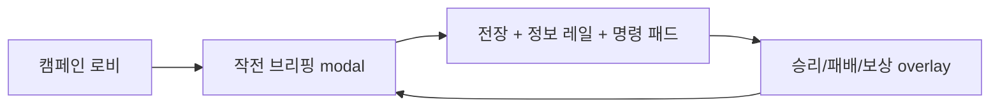

# 그림자 군주(Shadow Lord) RTS-RPG 하이브리드 — 통합 기획서

> **단일 진실 소스.** 이 문서는 4개 기획 문서를 병합한 최신본이다 (v2: 2026-07-17 방어 전투 `2f3833c` 반영).
> "확정(shipped)"은 라이브 배포에서 검증된 것, "비전(vision)"은 장기 방향이다.
> 수치의 canonical 소스는 리포지토리 `campaign-state.js`의 `BALANCE` 노브다 — 문서와 코드가 다르면 코드가 이긴다.

## 0) 한 줄 요약

**적 처치로 군단을 즉시 확장하고(무자원 루프), 영웅이 군단 전체를 통솔하는 RTS 전략감 + RPG 성장 만족의 하이브리드.** 웹/PWA 우선 → 검증 후 APK(TWA) 포팅.

## 1) 프로덕션 경계 (확정 계약)

- **릴리스 경계**: GitHub Pages 정적·오프라인·싱글플레이어. 브라우저 로컬 versioned save(IndexedDB+export/import)가 유일한 영속성. 계정/클라우드/멀티/결제/서버안티치트는 미래 게이트.
- **캠페인 모델**: 결정론 3-스테이지 캠페인 + save/replay 계약이 기준선. 서버 추상화나 미검증 풀-RTS로 대체하지 않는다.
- **권리**: 《나 혼자만 레벨업》은 *영감 레퍼런스*로만. 라이선스 증빙 없는 캐릭터명/유사 자산 생성·마케팅 금지. 신규 미디어 배치마다 자산별 출처·모델·프롬프트·SHA-256 기록.
- **검증 명령 계약**: `node --test tests/*.test.mjs`, `node scripts/run-campaign-balance-sim.mjs`, `node --check` 개별 명령이 증거 단위. npm 스크립트는 존재하지 않으므로 인용 금지 (package.json 없음 — tools/promo-video만 예외).
- **멀티플레이 마이그레이션 사다리**: P0 IndexedDB SaveEnvelope(현재) → Z1 save-envelope ghost-share 코드 공유(zero-backend, 측정: 287자/0.35ms) → 수요 검증 후 Supabase(RLS 필수) → 경쟁전은 서버 권위 런타임. 클라이언트 체크섬은 위조 방지가 아니라 손상 감지다.

## 2) 캠페인 구조 (확정, 라이브 검증)

| Stage | 무대 | 신규 전술 | 보스(HP) | 계승 |
|---|---|---|---|---|
| 1 | Cinder Span 잿빛 교량 | 사냥→추출→실체화→점령 기본 루프 | Cinder Warden (8) | 보상 1택 |
| 2 | Veil Citadel 장막 성채 | 빙의 해금, 거점 2 동시 유지 | Veil Tactician (10) | 보상 1택 |
| 3 | Echo Throne 메아리 왕좌 | 군주의 영역(일발역전, 1회) | Gate Sovereign (17) | 기록 보상 |

*수치 소스: `campaign-state.js` STAGES — `bossHealth` 8/10/17, `nodeGoal` 1/2/1.*

### 밸런스 v2 확정 수치 (시뮬레이터 + 라이브 실측)

- 보스 반격 기본 [1, 2, 8] − ⌊legion/4⌋ (하한 1) + 얇은군단(+1, legion < 2+stage). *(`campaign-state.js` counterBase/shieldDivisor/thinMargin/thinPenalty)*
- 플레이어 총공격 기본 [3, 3, 4] + 빙의 시 +1, Rift Lens 보유 빙의 시 추가 +4. *(`campaign-state.js` assaultBase/possessDamage/lensDamage)*
- integrity 스테이지 지속, 보상 선택 시 +1 (클램프 10). domain: +4 회복 + aegis 2회. *(`campaign-state.js` rewardRestore/maxIntegrity/domainRestore/domainAegis)*
- 아키타입 승률 (n=200): casual **51.0%** (밴드 45–55%), optimal 100%/25act, greedy 100%/56act, comeback 100% (domain 없으면 같은 라인이 패배), rusher **0%** (의도된 교훈).
- 콤보 EV 1.119× ≤ 1.3 — 4콤보 4결과 분화.
- **TTK 밴드 (확정)**: 스테이지 클리어 시간 목표 S1 **75s ±15%**, S2 **100s ±15%**, S3 **120s ±15%** (인간 페이스 5–15s/act × 라이브 실측 9–17act/스테이지에서 유도. 봇 실측: 7.1/8.8/9.3s @0.5s/act).
- 라이브 검증: 배포 사이트에서 47액션 풀캠페인 완주, S3를 integrity 0 직전 클리어. assault-우선 무모봇은 S2 사망(패배 도달 실증).

## 3) 전투화면 (현행 — 단일 화면 RTS 콕핏)

캠페인 진행 중에는 전장·임무/보스 정보·상태 자원·7행동 명령 패드가 한 화면에 상주한다. 스테이지 진입은 작전 브리핑 modal, 승리/패배/보상은 콕핏 위 결과 overlay로 처리하며 URL 이동·리로드·별도 씬 파일은 없다.



- `#stage-briefing`: 목표·작전·교리·보스와 내레이션 진입점.
- `#battle-field`: WebGL 주 전장과 Canvas 2D 폴백이 교대하는 중앙 전장.
- cockpit 정보/명령 패드: `campaign-state.js` 파생 상태와 사용 가능한 행동을 상시 표시.
- `#view-result`: 결과·보상·재시도를 전장 위에 격리하는 modal overlay.

### 컨트롤 패드 쿨타임 (UI 페이싱 레이어)

| 행동 | 키 | 기본 쿨타임 |
|---|---:|---:|
| Hunt | H | 4s |
| Extract | E | 6s |
| Materialize | M | 5s |
| Capture | C | 8s |
| Possess | P | 10s |
| Domain | D | 15s |
| Assault | A | 3s |

성공한 행동에만 쿨타임 시작. `activeCooldown = base × (1 − cooldownReduction)`, 감소 상한 50%.
*(수치 소스: `app.js` COOLDOWN_SECONDS, `campaign-state.js` getCampaignBenefits — clamp(cooldownReduction, 0, 0.5))*
**설계 원칙**: 쿨다운은 *실시간 페이싱 레이어*일 뿐, 상태 전이는 여전히 결정론 엔진이 판정한다. 세이브 트레이스에는 행동 순서만 기록되므로 리플레이 결정론이 유지된다.

### 방어 전투(defended battle) — 현행 선언형 인카운터

전투 뷰는 관전 연출만이 아니라, 렌더러가 제안한 `breach`·`wave-cleared` 사건을 `campaign-state.js`가 검증·기록하는 방어전이다. 웨이브 구성과 피해량은 프레젠테이션 상수가 아니라 각 스테이지의 `encounter` 선언이 소유한다.

| 선언 필드 | 역할 |
|---|---|
| `preparationSeconds`, `preparationLegion`, `preparationNodes` | 첫 웨이브를 예약하기 전 준비 조건과 시간 |
| `waves[].spawnAtSeconds` | 전투 시작 기준의 절대 웨이브 진입 시점 |
| `waves[].hostiles`, `hostileHealth` | 렌더러가 시각화할 적 수와 로컬 교전 내구도 |
| `waves[].breachDamage` | 권위 엔진이 수락된 breach에 적용할 피해 |

Stage 1의 현행 선언은 준비 8초/legion 4/node 1, `scout` 8초·2기 → `guard` 22초·3기 → `reinforcement` 36초·3기이며 모두 hostileHealth 2, breachDamage 1이다. `app.js`는 이 선언을 읽어 다음 미해결 웨이브 하나만 예약한다. 반복 소강 루프나 렌더러별 별도 적 수 공식은 없다.

**사건 흐름**

```text
준비 조건 충족 → start-wave(다음 선언 웨이브) → renderer 교전
               → wave-cleared → 다음 spawnAtSeconds 예약
               → breach → 권위 엔진이 해당 wave의 breachDamage 적용
마지막 wave-cleared → bossExposed=true, spawningStopped=true
```

- WebGL과 Canvas는 적이 포털 경계를 통과하면 현재 `stageId/waveId`의 `breach`를 제안한다. 엔진은 활성화된 다음 선언 웨이브와 일치할 때만 수락한다.
- 수락된 breach는 configured `breachDamage`만큼 aegis를 먼저 소모하고 남은 피해를 integrity에 적용한다. `encounter` 의미 이벤트가 세이브 trace에 기록되므로 리플레이는 렌더 프레임이 아니라 사건 기록을 재생한다.
- Canvas는 `PICKET_X=5.5`, `INTERCEPT_RANGE=3`, `CLASH_TICK_S=0.55`의 피켓 방어 연출을 유지한다. 아군 표시 내구도는 3, 적 표시 내구도는 웨이브 `hostileHealth`에서 읽는다. 이 로컬 수치는 캠페인 legion/integrity 수식이 아니다.
- WebGL은 원형 충돌 probe, 지형 고도/절벽 제한, 아군 요격·집결, 적 포털 전진으로 같은 선언 웨이브를 시각화한다.
- Assault는 보스 노출 뒤의 권위 `boss-assault` 사건으로만 보스 수치를 바꾼다. 이동·교전 클립과 파티클은 그 결과를 표현한다.

**캔버스 HUD** *(소스: `battle-visualizer.js` setHud/drawHud, 붉은 비네트 935행)*

- 좌상단 integrity 핍(채움=잔여, ≤3이면 적색 `#ff7f79`), aegis 보유 시 `AEGIS xN` 카운터, 우상단 보스 바(`BOSS n/max`).
- breach 순간 화면 가장자리 **적색 비네트 펄스** — "breach는 로그가 아니라 체감되어야 한다."


### 보상 확장 (전투화면 기획 반영)

- Stage 1: Ember Cohort(Materialize당 +2기) / Rift Lens(빙의 총공격 +4) / **Stillwater Hourglass(쿨타임 −20% + 2번째 Hunt 자동 추출)** / **Bulwark Brand(반격 −2, 하한 1 — id `shadebreaker-brand`)**.
- Stage 2: Veil Vanguard(S3를 legion 4로 시작) / Anchor Shard(S3 진입 integrity +2) / **Abyssal Banner(시작 aegis 1 + Materialize당 +1기)**.

*수치 소스: `campaign-state.js`의 `STAGES[].rewards[].effects` — `materializeBonus:2`, `possessedAssaultBonus:4`, `cooldownMultiplier:0.8` + `autoExtract:true`, `counterReduction:2`, Echo Throne `stageEntry.legion:4` / `stageEntry.integrity:2`, `entryAegis:1` + `materializeBonus:1`.*
- `getCampaignBenefits(state)`가 이 effect를 화면·전투용 파생 필드로 투영하는 단일 소스다.

### 전장 구현 (2026-07-18 현행 — WebGL 주 렌더러 + Canvas 2D 폴백)

전투 뷰는 정적 Web/PWA에서 두 표현 경로를 운용한다. **주 경로는 Three.js/WebGL `RealtimeBattle`**, reduced-motion 또는 WebGL/GLB 초기화 실패 경로는 **Canvas 2D `BattleVisualizer`**다. 두 렌더러 모두 `campaign-state.js`가 확정한 캠페인/인카운터 상태를 표현한다. 렌더러는 `breach`·`wave-cleared` 후보 이벤트를 전달할 수 있지만, 프레젠테이션 자산이 캠페인 수치를 직접 쓰지는 않는다.

- **주 WebGL 경로**: 스테이지 지형 1종 + `shade.glb` + `scout.glb` + 스테이지 보스 1종, 총 4개 템플릿을 로드한다. v2 GLB 팩은 ground-center pivot, 내장 albedo/normal, 선언 액션, 빌드 recipe·측정값·원본/출력 SHA-256을 기록한다.
- **WebGL 실제 채택 범위**: 적 웨이브는 현재 모두 `scout.glb`를 복제하고 웨이브 id를 아키타입 메타데이터로 둔다. `guard`·`reinforce` 메시가 리소스 팩에 있어도 주 렌더러의 적 실루엣으로는 아직 채택되지 않았다.
- **Canvas 2D 경로**: `iso-math.js`의 2:1 dimetric 투영, 하이트필드, 칼럼 스캔 피킹, painter queue, A* 이동, 분리 조향을 유지한다. 런타임에 GLB 파서나 별도 WebGL 컨텍스트를 추가하지 않는다.
- **GLB raster bridge**: `assets/images/battle/glb/manifest.json`의 `glb-raster-pack-v1`을 읽는다. 현행 45레코드는 액션 아틀라스 42개 + 지형 플레이트 3개이며, 15개 GLB 원본 전체와 원본/출력 SHA-256을 추적한다.
- **아틀라스 계약**: 액션 PNG는 1024×512(8방향 열 × 원본 프레임 1/10/20/30의 4행, 128px 셀), 지형은 128×128 정적 plate다. 정사영 카메라 고도 30°, yaw 45° 간격이다. 4 frame×8 yaw의 evaluated bounds와 root translation으로 10% 투명 moat를 잡았고 현행 최소 edge padding은 12px, 모든 action atlas의 animated direction column은 8개다.
- **브리지 부분 실패**: 유닛은 conceptual `dusk-legion-atlas.png`(8방향 × 2 idle-light phase) → 진영색 절차 실루엣, 보스는 스테이지 이미지 → 절차 삼각형, 지형은 절차 타일로 저하된다.
- **Stage 4–10 자산 면제**: 3종 지형/보스 GLB를 재사용한다. WebGL은 스테이지 `palette.hostile` 틴트, Canvas는 고유 보스 초상으로 정체성을 보조한다. 이는 고유 보스 실루엣을 대체한 것이 아니라 명시된 리소스 예산 면제다.
- **리소스 해제**: 전투 이탈·재시도 시 rAF, 타이머, 이벤트, AudioContext, mixer, 브리지 이미지/스프라이트 캐시를 해제한다.

### 현재 남은 프레젠테이션 채택 경계

- `shade/possessed/scout/guard/reinforce-atlas.png` 5종은 1024×128 단일행 8방향 레거시 산출물로 저장되어 있지만 현행 JS가 직접 선택하지 않는다.
- `sovereign-atlas.png`는 Stage 3 보스의 보조 이미지로 참조되며, `gate-sovereign__Idle` 브리지 아틀라스가 먼저 선택된다.
- `guard`, `jump`, `evade`, `explore`는 구현 완료된 행동 동사가 아니다. 현행 액션 어휘는 아래 5/3/2클립 계약만 canonical이다.

## 4) 리소스 현황과 단일 추적선

상세 인수 기준은 `_workspace/20260718-resource-refinement/design/presentation-spec.md`가 소유한다. 이 문서의 canonical 요약은 다음과 같다.

| 단계 | 현행 자산/계약 | 다음 단계 | 런타임 |
|---|---|---|---|
| **메시·재질** | v2 `abyssal-command` 15 GLB: 유닛 5, 보스 3, 프롭 4, 지형 3; flat-shaded PBR, bevel edge, 내장 텍스처, ground-center, 빌드 recipe·측정값·SHA-256 | `<asset-id>-root`, 팩 `manifest.json` | WebGL 또는 Blender 래스터 생성기 |
| **리깅·액션** | 유닛 5클립, 보스 3클립, 프롭 2클립, 지형 정적; 유닛 `body-control`/`equipment-control` 보조 채널, 클립별 channel 수 6/5/5/6/4, `Move` root translation 없음 | `<asset-id>__<Clip>` 선언 이름/순서 | `RealtimeBattle.play()` / `render-8dir-atlas.py` |
| **스프라이트** | `glb-raster-pack-v1`, 45레코드, 8열×4행/128px 셀 | 브리지 매니페스트·출력 SHA-256 | Canvas 동일 출처 PNG; GLB 파서 없음 |
| **오디오·비디오** | MP3 의미 큐/내레이션/ambient/BGM, MP4 전환·선택형 시네마틱 | 의미 행동·스테이지 키, 미디어 해시 | 수락된 행동·브리핑·로비에만 결합 |
| **런타임** | WebGL → Canvas → 이미지/도형/텍스트 폴백 | 로드 상태와 캠페인 상태 분리 | 결과 권위는 항상 `campaign-state.js` |

### 4.1 아트 디렉션과 실루엣 규칙

**아트 문장**: 차갑고 무거운 저폴리 군세가 심연의 발광 균열을 둘러싸고, 제한된 색과 날카로운 가장자리로 명령 가능한 실루엣을 만든다.

1. subdivision으로 면을 둥글게 하지 않는다. 기존 faceted plane과 bevel edge가 작은 화면에서 면 전환을 만들게 한다.
2. 색을 제거해도 `shade`의 양 sickle/X·후방 cloak tail, `scout`의 창·quiver/scarf, `guard`의 tower shield·halberd H, `reinforce`의 horn crown·중량 maul, `possessed`의 halo·비대칭 결정이 구분되어야 한다.
3. 8방향은 색이 아니라 어깨·망토·무기 겹침과 negative space로 구분한다. 정면/후면과 좌우 대각이 같은 윤곽이면 불합격이다.
4. 모든 root와 authored body/plinth 지면 중심은 ground-center이며 authored Z-up/runtime Y-up 최저점이 0m다. 포즈 중 하단 접점이 잘리거나 그림자에서 뜨면 안 된다. 비대칭 장비로 전체 AABB 수평 중심이 최대 0.272168m 어긋나는 것은 허용한다.
5. 검수 크기는 원본 128px만이 아니다. Canvas의 일반 유닛 약 64px, 강화 적 약 76px, 보스 약 82px에서도 머리·무기·진영이 읽혀야 한다.
6. 아군=청록/냉색, 적=적색·주황/온색, 빙의·영역=보라, 목표·권위=금색을 우선하되 실제 값은 `battle-presentation.js`의 스테이지 팔레트를 따른다.
7. 파티클·링·트레일은 접촉점과 의미 대상을 강조한다. 몸통 외곽선, 선택 링, 포털, 노드, 보스 노출 상태를 장시간 가리지 않는다.

### 4.2 현행 행동 동사와 포즈 목적

행동 결과는 먼저 `campaign-state.js`/인카운터 이벤트가 수락한 뒤 표현된다. 거부되거나 쿨다운 중인 입력에는 포즈·사운드·효과를 재생하지 않는다.

| 의미 행동 | 표현 소스 → 대상 | 포즈 | 전달 목적 | 결과 권위 |
|---|---|---|---|---|
| **Hunt** | portal → extractor | `shade__Special` | 탐지 개시와 목표 포착 | 엔진 |
| **Extract** | extractor → portal | `soul-extractor__Activate` | 영혼 흡입과 회수 | 엔진 |
| **Materialize** | portal → portal | `rift-portal__Activate`, commander `Special` | 군단 생성 | 엔진 |
| **Capture** | portal → node | `command-obelisk__Activate` | 거점 잠금 | 엔진 |
| **Possess** | portal → ally | `possessed__Special` | 제어권 전이 | 엔진 |
| **Domain** | portal → portal | `echo-throne__Activate` | 영역 개방 | 엔진 |
| **Assault** | ally → boss | `shade__Strike`, 노출 보스 `Attack` | 가장 무거운 공격 결산 | 엔진 |

| 액션 클립 | 포즈 목적 | 현행 사용 |
|---|---|---|
| 유닛 `Idle` | 병종·무기 방향을 읽는 안정 기준 | 정지 actor |
| 유닛 `Move` | 진행축·속도·발 접지 | commander/ally/enemy 이동 |
| 유닛 `Strike` | 예비→접촉→회수의 한 타 | 근접 교전, Assault |
| 유닛 `Special` | 일반 타격과 다른 소환·탐색·빙의·영역 신호 | 의미 행동, 아군 생성 |
| 유닛 `Defeat` | 높이와 전투 가능 실루엣 해제 | 로컬 교전 패배 뒤 `Defeat`에 latch |
| 보스 `Idle/Attack/Defeat` | 위협 유지/반격 강조/정점 종료 | 권위 상태를 표현만 함 |
| 프롭 `Idle/Activate` | 기능 위치/수락된 상호작용 표시 | Canvas 의미 대상 |

브리지의 4개 행은 새 4포즈가 아니라 같은 액션의 프레임 1/10/20/30 샘플이다. reduced-motion에서는 첫 행만 사용하고, 정상 Canvas는 125ms 간격으로 네 행을 순환한다.

## 5) 사운드·시네마틱 전달 계약

### 사운드 큐 역할

| 큐 | 의미 역할 |
|---|---|
| `hunt.mp3` | 탐지 시작과 표적 포착 |
| `extract.mp3` | 흡입·회수 완료 |
| `materialize.mp3` | 질량이 생기는 상승형 소환 |
| `capture.mp3` | 짧은 점령 잠금 |
| `possess.mp3` | 주체 사이 제어권 전이 |
| `domain.mp3` | 넓고 지속적인 영역 개방 |
| `assault.mp3` | 가장 무거운 공격 결산 |
| `reward.mp3` | 보상 선택 수락과 다음 상태 진입 |
| `wave-spawn.mp3` | 권위 `start-wave` 수락과 적 진입 |
| `breach-alert.mp3` | 권위 `breach` 수락과 방어선 손실 경보 |
| `battle-bgm.mp3` | 사용자가 BGM을 켠 뒤 전투 장면의 압박 루프 |

- 수락된 7행동은 WebGL에서 해당 MP3를 3D sample로 재생하고, Canvas에서는 가상 리스너 기반 oscillator gesture로 전달한다. 근접 충돌·defeat·wave-clear의 짧은 절차 tone은 고빈도 공간 피드백이며 app-level MP3 의미 큐를 대체하지 않는다.
- `wave-spawn.mp3`와 `breach-alert.mp3`는 직렬화된 인카운터 사건 큐가 각각 권위 `start-wave`/`breach`를 수락한 뒤 단일 비공간 cue player로 재생한다. 동일 큐 150ms guard가 중첩을 억제한다.
- `ambient.mp3`는 전투 중 별도 사용자 토글, `bgm-theme.mp3`↔`battle-bgm.mp3` 장면 전환은 사용자가 BGM을 켠 뒤에만 반복 재생한다. 전투 이탈은 cue/ambient source를 해제하고, BGM이 활성화되어 있었다면 로비 테마를 복원한다. 자동재생하지 않는다.
- `narr-intro`, `narr-stage1/2/3`, `narr-victory`, `narr-defeat`는 같은 텍스트 타이핑·screen-reader 문장과 결합한다. Stage 4–10은 현재 텍스트 내레이션만 있다. `click.mp3`는 공급 파일이지만 현행 JS 직접 참조가 없다.

### 시네마틱 목표와 런타임 폴백

- 로비 시네마틱은 사냥→추출→소환→거점→빙의/영역→보스 압박→귀환의 판타지를 요약하는 **선택형** 매체다. 재생을 캠페인 시작 조건으로 만들지 않는다.
- Stage 1–3 전환 영상은 장소 분위기를 5초 안에 전달한다. 목표·보스명·명령은 텍스트 브리핑이 소유한다.
- 신규/갱신 MP4 목표는 H.264, yuv420p, 960×540, 24fps, faststart다. 현행 전환 경로는 `cinder-span.mp4`, `veil-citadel.mp4`, `echo-throne.mp4`를 참조하지만 shared inventory는 세 파일의 출처·해시만 완전히 추적하고 코덱/프레임률/faststart 검증 artifact는 보유하지 않는다. 따라서 전환 영상은 이 프로필을 통과했다고 선언하지 않는다.
- 현행 `abyssal-surge-cinematic.mp4`는 H.264 High/yuv420p/960×540/24fps/faststart, 19.02초, AAC-LC다. 3개 VTT cue와 시각 설명문이 실제 3전장 몽타주 시간축에 맞는다.
- 로비 영상은 Cinder poster, `preload="none"`, 사용자 버튼 로드, 최초 음소거, `playsinline`, native controls, 한국어 VTT, MP4 직접 링크를 쓴다. loading/ready/playing/paused/ended/unavailable 상태를 알리고 unavailable 시 링크·시각 설명문·텍스트 브리핑을 유지하며 다음 재생 요청으로 canonical MP4를 다시 로드한다.
- reduced-motion에서는 스테이지 전환 MP4를 로드하지 않고 정적 stage art와 텍스트를 유지한다.

### 런타임 폴백 사다리

1. `RealtimeBattle` WebGL + GLB 연속 액션.
2. reduced-motion/초기화/컨텍스트/GLB 실패 시 정적 전술 브리핑 sidecar와 `BattleVisualizer` Canvas 2D를 표시한다.
3. Canvas가 초기화되면 명령 패드는 계속 활성이다. Canvas 초기화 자체가 실패하면 정적 브리핑은 남지만 `visualizer=null`이므로 행동 입력은 renderer 복구 전까지 비활성이다.
4. 브리지 일부 실패 시 conceptual 8방향 atlas/스테이지 이미지/절차 도형·타일.
5. 오디오 실패 시 무음 + 시각/상태/접근성 문구 유지.
6. 비디오 실패 시 정적 stage art + fallback 링크 + 텍스트 브리핑 + 시각 설명문 유지.
7. 어느 실패도 그 자체를 행동 실패·breach·패배·보상으로 직접 기록하지 않는다.

- 명명과 출처: 신규/갱신 자산은 `assets/media-manifest.json` 또는 이 런의 engineering 리소스 매니페스트/보고서에 출처·생성 방식·프롬프트/절차 레시피·SHA-256을 기록한다. Sprite 생성 pass는 DR-007/`--skip-media-manifest`로 충돌을 피한 뒤 serialized reconciliation을 거쳤다. 현재 45개 PNG의 런타임/생성 권위는 `assets/images/battle/glb/manifest.json`과 `engineering/sprite-bridge-report.md`, shared media manifest의 해당 45개 bridge 항목은 파일과 일치하는 보조 inventory다.
- 서비스 워커: 정적 오디오/영상은 명시 캐시 목록을, GLB raster bridge는 매니페스트에서 검증한 동일 출처 출력 목록을 사용한다.

- **독립 후보 레인**: 상세 근거와 입고 판정은 presentation spec이 소유한다. 2026-07-18 현재 GTI는 비런타임 콘셉트 후보 생성, PerfectPixel은 provider 차단으로 미생성, Motion Previs는 분석 번들만 완료했다. Vox는 로컬 Pillow/FFmpeg 기반 22.625초 H.264 paper-collage 후보를 만들었으나 canonical 시네마틱·앱·서비스 워커·공유 매니페스트에는 채택하지 않았다. 보고서 또는 파일만으로 shipped 승격하지 않는다.

## 6) 장기 비전 (미구현 — 순서 있는 백로그)

현행 직접 이동·단일 콕핏 이후에도 남아 있는 v1 실시간 RTS 확장분만 *비전 백로그*로 유지한다. 구현 순서는 전투화면(3장)의 검증 결과가 결정한다.

1. **직접 조작 잔여 확장**: WASD/방향키 이동·Shift 돌진·지면 클릭/탭 집결은 구현됨. Space RPG/전술 뷰 토글, QWER 스킬, 틸드 전군 회군은 미구현 비전 백로그.
2. **빙의(Possession) 실시간화**: Tab/휠클릭 유닛 빙의 + 자동복귀. (현재: P 커맨드 + 전투 뷰 연출)
3. **슬롯 경제 확장**: 일반 1 / 정예 2 / 기사 5–10 / 장군 20–25, 상한 100. 대표 유닛(벨리온/베르/이그리트/어금니/아이언/탱크). (현재: 균일 1슬롯, capacity 10–100 클램프만 확정)
4. **성장 수식**: P_shadow(t) = ⌊P_base + α·ln(1+β·L_h) + ΣΦ_i⌋ (α=15, β=1.2, Φ=8, N≤5). **status: deprecated-until-realtime** — v2 BALANCE 노브가 현행 canonical.
5. **Comeback 3종**: 군주의 영역(✅ v2 구현) · 그림자 교환(영웅↔유닛 순간이동, 미구현) · 심연의 흡수(전군 소모→영웅 폭발 버프, 미구현).
6. **AI 보조**: 체력 25% 자동 퇴각, 수용소 귀환(Backstep).
7. **장기 리텐션**: 성소 영구 업그레이드, 매치 결과 반입, 레이드 모드.
8. **세션 페이즈**: 0–10분 약체 사냥 / 10–20분 거점+기사 / 20–35분 장군+본영. (현재 캠페인은 스테이지당 75–120s — 비전과 스케일이 다름을 명시)
9. **시나리오 패키지 A–G**: 실시간 모드 검증용 7종 시나리오(항만 첫 수렵 ~ 역습의 마지막 축선) — 전투화면이 실시간화될 때 테스트 계획으로 승격.

## 7) 릴리스·검증 기록 (누적)

- **2026-07-16 Stage1 슬라이스**: 결정론 3-스테이지 캠페인 + versioned save + 시네마틱(13s H.264). 모바일 브라우저 3스테이지 완주 검증. Gemini 키 무효/ElevenLabs voice-list 권한 부재/Blender MCP 타임아웃 → 안전 폴백 기록.
- **2026-07-16 Pages 릴리스**: `cbd0633` 배포, Actions run 29505217329, 미디어 해시 10종 매니페스트 일치, 롤백 경로 = workflow_dispatch `rollback_revision`.
- **2026-07-16 S1 인시던트**: 커밋된 편집 마커 2개가 배포 SyntaxError 유발 → 수복 + CI에 마커 가드 추가.
- **2026-07-16 밸런스 v2**: B1–B5 결함(패배불가/보상무효/역전불가/함정possess/전략공간 1종) 수치 증명 → 8회 노브 반복으로 casual 51.0% 도달. 테스트 14/14, 퍼저 150k op 0건.
- **2026-07-16 전투화면 SPA**: 4뷰 전환 + 2.5D 웨이브 전투 + 쿨타임 + breach 구현. 상태 테스트 16/16. E2E는 playwright 의존성 부재로 미실행(아래 회고 참조).
- **2026-07-17 방어 전투 (`2f3833c`, 역사 기록)**: 당시 피켓 라인 AI + 라이브 심 breach + 교전 틱 + 표현 전용 재배치 + 캔버스 HUD와 5개 수동 라인을 검증했다. 이후 웨이브/피해 계약은 현재 3장의 선언형 `encounter`·권위 사건 흐름으로 교체되었으므로 이 수치를 현행 규칙으로 사용하지 않는다.
- **성능 (라이브)**: frame p95 9.2ms (예산 16.7), 롱프레임 0/300, 힙 3.1MB, SW v2 캐시 0-transfer.

## 8) 기획 회고 (2026-07-17) — 비전 vs 출하 갭과 개선 적용

### 무엇이 맞았나
1. **무자원 루프는 축소판에서도 재미 축으로 성립** — 사냥→추출→실체화→점령이 시맨틱 커맨드로도 G7 루프 밴드를 통과했고, 반복 경제(v2)로 greedy 아키타입(만벽 요새, 56act)까지 분화됨.
2. **결정론 엔진 우선 전략이 유효** — save/replay 계약 덕에 쿨다운·breach·battle 뷰가 추가되어도 리플레이 검증이 깨지지 않음(16/16).
3. **일발역전 설계는 domain 1종으로 이미 증명** — "같은 라인이 domain 없으면 패배"가 시뮬+라이브 양쪽에서 재현.

### 무엇이 어긋났나 (→ 적용 개선)
1. **v1 수치 모델(로그 성장식)이 코드와 무관하게 문서에 잔존** → 본 문서 6.4에 `deprecated-until-realtime`로 강등하고 canonical을 BALANCE 노브로 선언. *(적용 완료: 이 문서)*
2. **TTK 목표가 초 단위로 정의되지 않아 G2 TTK 행이 판정 불가였음** → 2장에 S1 75s / S2 100s / S3 120s ±15% 확정. 리포 balance-sheet에 band-overrides로 동기화 필요. *(적용: 이번 사이클)*
3. **기획 문서 4분화로 전투화면 기획이 캠페인 수치와 따로 놀았음** (쿨타임 감소 보상 Stillwater Hourglass가 EV 검증 대상에 미포함) → 단일 문서로 병합 + 다음 시뮬 배치에 쿨타임-감소 콤보의 EV 재검증 항목 추가. *(개선 항목 → 다음 사이클 G2)*
4. **전투화면 E2E가 playwright 의존성 부재로 미실행** — 검증 명령 계약(1장)에 따라 "미실행"으로 정직 기록됨. 개선: headless Puppeteer(브라우저 도구) 경로가 이 세션에서 이미 검증되었으므로 `tests/playtest-browser-3stage.cjs`를 puppeteer-core 폴백으로 이식하거나 CI에서 의존성 설치. *(개선 항목 → 다음 사이클 QA)*
5. **전투 전장이 절차 프리미티브뿐 + 행동 동사·AI 로직 미정의** — 리소스 계획(4장)과 동사 사전/FSM(4.1–4.2)으로 승격: P1 = 플레이어/적 3종/전장 바닥/breach 경보 + move/strike/guard 동사, P2 = cast/jump/evade + Scout 정찰 AI. *(개선 항목 → 다음 리소스 배치)*
6. **위키 파편화 자체가 회고 대상** — 자동 수집 노이즈(system-instructions 60여 건)가 index를 지배해 기획 문서 발견성이 나빴음. 개선: 기획은 이 canonical 문서 1개만 유지, 세션 노이즈는 queries/sources에 격리(파이프라인 소유이므로 삭제하지 않음).

### 다음 사이클 진입 결정
**stage-2-retune** (사이클 1 최종 회고와 일치): ① 리소스 P1 배치 + 행동 동사 P1(move/strike/guard) → ② AI NPC FSM 구현(4.2, 시드 고정 + breach 유일 접점) → ③ 쿨타임 보상 포함 시뮬 재검증(G2) → ④ 전투화면 E2E 복구(QA) → ⑤ G4 몰입 스코어링 인간 세션 10회.

## 관련
- 리포지토리 문서: `docs/screen-layout-planning.md`, `docs/stat-item-schema.md`, `docs/shadow-lord-rts-rpg-hybrid-design.md` (이 문서의 리포 미러, frontmatter 없음)
- 게이트 원장: `_workspace/20260716-shadow-lord-rts-rpg/qa/gate-measurements.md`
- 회고 시스템: `_workspace/20260716-shadow-lord-rts-rpg/retrospectives/` (Pydantic 검증, carry-forward 큐)
