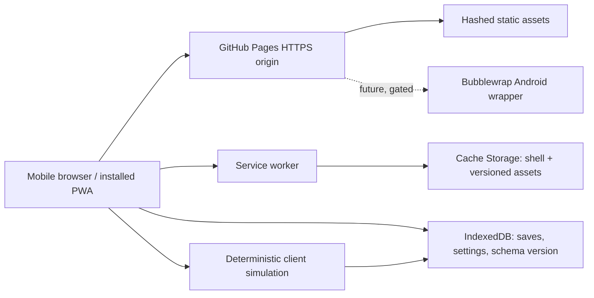

# Abyssal Surge — 정적 웹/PWA 출시와 Android TWA 전환 조사

## 범위

이 문서는 **모바일 우선, 오프라인 우선인 정적 웹/PWA 1차 출시**를 GitHub Pages에 배포하고, 검증된 웹 릴리스 이후에만 Android **Trusted Web Activity (TWA)** APK/AAB로 패키징하는 경로를 정의한다. 현재 범위에는 서버, 계정, 클라우드 세이브, 실시간 멀티플레이, 결제, 원격 밸런싱이 포함되지 않는다. 저장 데이터는 기기와 브라우저 프로필에만 남는다.

## 출처 — 5개 공식/1차 문서

1. GitHub Docs — GitHub Pages는 리포지터리의 정적 파일을 게시하는 호스팅 서비스이다: https://docs.github.com/en/pages/getting-started-with-github-pages/what-is-github-pages
2. web.dev — Cache API와 서비스 워커 캐시 제어: https://web.dev/articles/cache-api-quick-guide
3. MDN Web Docs — IndexedDB 사용법, 비동기 트랜잭션 및 저장소 모델: https://developer.mozilla.org/en-US/docs/Web/API/IndexedDB_API/Using_IndexedDB
4. web.dev — 성능 예산의 정의와 회귀 방지 방법: https://web.dev/articles/defining-performance-budgets
5. Chrome Developers — TWA quick start, Bubblewrap, Digital Asset Links: https://developer.chrome.com/docs/android/trusted-web-activity/quick-start

## 근거 기반 사실과 설계 함의

| 근거 | 사실 | Abyssal Surge 적용 |
| --- | --- | --- |
| GitHub Pages [1] | Pages는 정적 파일 게시용이다. 요청별 서버 코드나 상주 프로세스를 실행하지 않는다. | 최초 릴리스는 빌드 산출물 `HTML/CSS/JS/images/audio/manifest/service-worker`만 배포한다. 모든 전투 판정, AI, 저장은 클라이언트에서 실행한다. |
| Cache API [2] | 서비스 워커는 요청을 가로채며 Cache Storage는 코드가 제어하는 `Request`/`Response` 쌍 저장소다. | 캐시는 **배포 가능한 리소스**만, 게임 진행 상태는 IndexedDB만 담당한다. 두 저장소를 섞지 않는다. |
| IndexedDB [3] | IndexedDB는 비동기·트랜잭션 기반의 구조화 데이터 저장소이며 same-origin 경계를 따른다. | 저장 슬롯, 캠페인 스냅샷, 설정, 스키마 버전, 재생성 가능한 시드에 사용한다. 저장 실패와 quota 부족은 사용자에게 표시하고 새 저장을 거부한다. |
| 성능 예산 [4] | 예산은 크기/요청 수와 타이밍 지표의 회귀를 막는 배포 계약이다. | 모바일 저속 네트워크와 보급형 Android를 기준으로 명시적 크기·렌더·입력 예산을 릴리스 게이트로 둔다. |
| TWA [5] | TWA는 검증된 웹 origin과 Android 앱의 Digital Asset Links 관계가 필요하며 Bubblewrap으로 Android 프로젝트를 생성·빌드할 수 있다. 검증이 실패하면 브라우저 UI가 있는 Custom Tab으로 후퇴한다. | APK는 웹판과 별개의 기능 경로가 아니라, 통과한 PWA URL을 감싼 후속 배포물이다. 서명 인증서 SHA-256과 `/.well-known/assetlinks.json`을 릴리스 전 검증한다. |

## 권장 정적 출시 아키텍처

### 배포 산출물과 경계

- **App shell precache:** 진입 HTML, CSS, 시작 JavaScript, manifest, 아이콘, 최소 HUD/font 및 첫 전투에 필요한 작은 필수 자산만 설치 단계에서 precache한다. 설치가 하나라도 실패하면 새 서비스 워커를 활성화하지 않는다.
- **Versioned gameplay assets:** 해시 파일명으로 배포하고, 첫 진입 후 선택적으로 cache한다. 대형 음성·고해상도 일러스트·선택 캠페인은 설치 시 전량 cache하지 않는다. 다운로드 상태와 용량을 UI로 보인다.
- **Navigation:** HTML navigation은 network-first 후 마지막 정상 app shell 또는 `offline.html`로 폴백한다. 캐시된 shell을 반환할 때도 현재 에셋 manifest와 호환되는지 확인한다.
- **Static files:** 해시된 CSS/JS/이미지/폰트는 cache-first; 버전 manifest 및 배포 메타데이터는 network-first 또는 stale-while-revalidate로 한다. 캐시 이름은 릴리스 식별자(`abyssal-surge-static-<release>`)를 포함하며, 새 워커 활성화 후에만 이전 정적 캐시를 정리한다.
- **절대 cache하지 않을 것:** 인증 토큰, 개인 데이터, 비결정적 원격 응답, 실패한 HTTP 응답, cross-origin opaque 응답, 무제한 미디어. 현 릴리스에서는 이 데이터 자체를 도입하지 않는다.
- **저장 모델:** IndexedDB에 `meta`, `saveSlots`, `settings` object store를 둔다. `meta.schemaVersion`, 콘텐츠 버전, checksum, 수정 시각을 저장한다. 슬롯 쓰기는 하나의 트랜잭션으로 수행하고, 읽을 때 checksum과 스키마 호환성을 확인한다. 캐시 삭제는 세이브 삭제가 아니며, 세이브 삭제도 캐시 삭제가 아니다.

### 오프라인 동작 계약

1. 온라인에서 app shell과 선택한 캠페인 자산이 완전히 내려받아진 뒤에는 비행기 모드에서도 앱 재시작, 메뉴, 저장 슬롯 로드, 기존/이미 내려받은 캠페인 플레이와 저장이 가능해야 한다.
2. 아직 내려받지 않은 콘텐츠와 향후 원격 기능은 오프라인에서 실패 대신 **명시적 잠금/다운로드 필요 상태**를 보여야 한다. 네트워크 재시도를 무한 반복하지 않는다.
3. 서비스 워커 업데이트는 플레이 중 강제 `skipWaiting`으로 적용하지 않는다. `업데이트 준비됨 — 재시작 후 적용`을 표시하고, 저장이 완료된 재시작만 허용한다.
4. 브라우저 데이터 삭제, 비공개 모드, 저장소 축출(quota pressure)은 영구 보존이 아니다. 사용자 내보내기/가져오기 전까지 기기 간 이전이나 복구는 제공하지 않는다고 명시한다.

## GitHub Pages의 명시적 한계와 이후 확장 게이트

GitHub Pages는 이 계약에 맞는 정적 호스트이지만 다음을 제공하지 않는다.

- 사용자 계정, 권한 부여, 비밀 보관, 서버 검증, REST/GraphQL API, 웹훅 소비, 큐/worker, 데이터베이스, 매치메이킹, authoritative simulation, 치트 방지, 리더보드 집계 또는 서버 측 분석.
- IndexedDB 세이브 동기화·백업·공유. 동일 origin/브라우저 프로필 내 저장소일 뿐이며, 사용자가 데이터를 지우거나 브라우저가 저장소를 축출할 수 있다.
- WebSocket 기반 실시간 멀티플레이. 클라이언트끼리 신뢰할 수 없으므로 경쟁/협동 상태를 정적으로 동기화할 수 없다.

**권고:** 1차 출시는 완전 단일 플레이어/오프라인 결정론 시뮬레이션으로 동결한다. 클라우드 세이브, 계정, 결제, 라이브 밸런싱, 멀티플레이는 별도 백엔드·개인정보·보안·운영·서버 권위 설계가 승인된 후에만 시작한다. 이 후속 단계는 정적 릴리스의 가정을 바꾸므로 “작은 API 추가”로 취급하지 않는다.

## 모바일 성능·접근성의 측정 가능한 릴리스 예산

측정 조건은 Chrome Android의 **모바일 에뮬레이션 또는 실제 보급형 Android**, cold cache, 4× CPU slowdown, Fast 4G(또는 동등한 재현 가능한 throttling)로 고정하고 결과에 조건을 기록한다. 전투 중 실측은 실제 장치에서도 별도 기록한다.

| 영역 | 출시 목표 | 측정 증거 |
| --- | --- | --- |
| 초기 전송량 | 최초 app shell 압축 전송량 **≤ 500 KB**, 초기 JavaScript gzip/brotli **≤ 250 KB**, 초기 필수 이미지·폰트 **≤ 200 KB** | Network export 또는 Lighthouse/DevTools 전송량 표 |
| 요청/렌더 | 초기 critical request **≤ 25**, LCP **≤ 2.5 s**, CLS **≤ 0.10** | 고정 조건 Lighthouse mobile report |
| 입력/프레임 | 메뉴/지도 상호작용 INP **≤ 200 ms**; 전투 렌더 p95 frame time **≤ 33.3 ms**(30 FPS), 장시간 작업은 한 프레임에 **≤ 50 ms** | Performance trace 및 입력 마커가 있는 기록 |
| 반응형 | CSS viewport **320 px, 360 px, 390 px, 768 px, 1024 px**에서 가로 스크롤 0, HUD/전투 명령이 가려지지 않음 | 각 폭의 스크린샷과 DOM scroll-width 확인 |
| 터치 | 주요 조작의 시각적·실제 hit target **최소 44×44 CSS px**, 핀치 확대 없이 모든 핵심 명령 수행 | 실제 터치 또는 DevTools emulation 증거 |
| 접근성 | Lighthouse Accessibility **100**, keyboard-only 흐름에서 보이는 focus, 모든 icon-only 조작에 접근 가능한 이름, 텍스트/필수 컨트롤 대비 **≥ 4.5:1** | Lighthouse 보고서 + 수동 keyboard/focus/contrast 검사 |
| 오프라인 | 서비스 워커 설치 후 offline reload 100% 성공, 기존 저장 슬롯 load/save 성공, 미다운로드 콘텐츠는 안내 상태 | Network offline 시나리오 캡처 + IndexedDB 검사 |

Lighthouse는 자동 검사일 뿐이므로 접근성 통과를 단독 증거로 쓰지 않는다. 스크린 리더의 명령 이름, focus 순서, touch 조작, reduced motion, 가로/세로 회전은 수동 브라우저 검증이 필수다.

## 안전한 테스트 · 배포 · 롤백 경로

### 1. 배포 전 브라우저 증거

- HTTPS 배포 후보에서 manifest, 아이콘, start URL, 서비스 워커 scope/activation, cache 목록, IndexedDB 스키마와 migration 경로를 확인한다.
- Chrome Android 및 데스크톱 Chrome, Firefox, Safari iOS에서 최소 진입·메뉴·전투·저장·재시작을 실행한다. 비지원 기능은 무음 실패 대신 기능 축소 메시지를 보인다.
- **offline matrix:** 첫 온라인 로드 → 서비스 워커 설치 확인 → 네트워크 offline → 새 탭/새로고침 → 저장 로드 → 전투 → 저장 → 온라인 복귀 → 업데이트 감지 순서를 기록한다.
- **update matrix:** 구버전 세이브가 신버전에서 열리고, 실패 시 원본 슬롯을 손상시키지 않으며, 캐시 purge 뒤에도 DB가 보존되는지 확인한다. 반대로 IndexedDB 삭제 뒤 UI가 정상 빈 상태로 회복되는지도 확인한다.
- 성능·접근성 표의 수치를 배포 후보마다 남기고, 하나라도 예산을 넘으면 크기/작업/자산 원인을 해결하거나 명시적 릴리스 승인 없이 배포하지 않는다.

### 2. GitHub Pages 배포

1. 불변 커밋/태그에서 정적 산출물을 게시하고, manifest와 서비스 워커의 release ID가 같은지 확인한다.
2. 공개 URL에서 fresh-profile cold load와 설치 후 offline reload를 다시 수행한다.
3. 배포 메타데이터(커밋 SHA, release ID, 생성 시각, Lighthouse/오프라인 증거 링크)를 남긴다. 외부 분석 의존 없이 정적 페이지 자체가 동작해야 한다.
4. 한 번에 배포를 덮어쓴 뒤 캐시를 강제 초기화하지 않는다. 이전 release cache는 새 워커가 검증·활성화된 후에만 제거한다.

### 3. 롤백

- 장애 시 이전의 검증된 정적 release를 Pages에 재게시하고, 새 서비스 워커에는 **더 높은** cache/release ID를 부여해 문제 자산을 대체한다. 동일 cache 이름 재사용은 이미 설치된 사용자를 고장 난 파일에 묶을 수 있으므로 금지한다.
- 롤백은 IndexedDB를 삭제·다운그레이드하지 않는다. 새 저장 스키마가 이전 클라이언트와 호환되지 않을 변경은 먼저 **읽기 가능한 migration/backup**이 증명될 때만 배포한다.
- Pages 장애나 정적 파일 손상은 되돌릴 수 있으나, 브라우저 저장소 삭제는 복구할 수 없다. 이 위험은 출시 UI와 지원 문구에 명시한다.

## 웹 → TWA(Android) 전환: 승인형 결정 체크리스트

다음 항목이 모두 충족되기 전에는 APK/AAB 작업을 시작하지 않는다. **한 항목이라도 실패하면 PWA만 유지**하고 실패 원인을 웹 릴리스에서 해결한다.

### Gate A — 웹 제품 준비

- [ ] 공개 HTTPS origin에서 `manifest.webmanifest`, scope, start URL, 아이콘, `display`가 설치 가능한 PWA 계약을 충족한다.
- [ ] Gate의 모바일 성능/접근성/반응형/오프라인 증거가 동일 release ID에서 통과했다.
- [ ] Android Chrome 실제 기기에서 설치 PWA, offline restart, 저장 슬롯 migration, update prompt가 검증됐다.
- [ ] 모든 필수 게임 자산과 타사 라이브러리의 라이선스/귀속 정보가 Android 배포에도 유효하다. 저작권 캐릭터·무허가 에셋은 포함하지 않는다.
- [ ] 웹 origin과 start URL이 장기적으로 안정적이다. GitHub Pages URL/커스텀 도메인을 바꾸면 Digital Asset Links를 재검증해야 한다.

### Gate B — 신뢰 관계와 Android 패키징 준비

- [ ] Android package name, versioning 정책, 최소/대상 SDK, 앱 이름·아이콘·splash screen, privacy/data-safety 선언 책임자가 확정됐다.
- [ ] 릴리스 signing key와 백업/접근 통제가 확정됐다. 이후 Google Play App Signing을 쓰면 **Play 배포 인증서 SHA-256**도 Digital Asset Links에 반영한다.
- [ ] `https://<origin>/.well-known/assetlinks.json`이 HTTPS에서 200과 `application/json`으로 제공되며, package name과 올바른 SHA-256 fingerprint를 포함한다. origin을 여러 개 쓰면 각 origin에 대응하는 파일이 있다.
- [ ] Bubblewrap으로 PWA manifest에서 Android 프로젝트를 생성하고, 서명된 APK(내부 배포)와 AAB(Play 배포)를 재현 가능하게 빌드한다.
- [ ] Android 기기에서 주소창 없는 TWA launch가 확인됐다. 주소창이 보이면 Digital Asset Links/서명/origin 검증 실패이므로 출시하지 않는다.

### Gate C — 패키지 출시 검증과 롤백

- [ ] 실제 Android Chrome/WebView 지원 상태에서 online cold start, installed/offline restart, 저장, 회전, background/foreground 복귀, low-storage 오류를 테스트했다.
- [ ] Play 내부 테스트 트랙에서 서명·asset link·앱 업데이트·새 PWA release를 함께 확인했다. 웹과 APK의 release ID/호환 범위가 기록됐다.
- [ ] Android 롤백은 Play Console의 이전 안정 앱 버전/중단 처리와, 별도의 이전 정적 웹 release 재게시 절차를 각각 갖춘다. APK만 되돌리고 웹을 두면 TWA가 새 웹을 여는 문제가 남는다.

## 트레이드오프와 추천

| 선택 | 이점 | 비용/위험 | 결정 |
| --- | --- | --- | --- |
| GitHub Pages + 정적 PWA | 낮은 운영 복잡도, HTTPS 정적 배포, 오프라인 가능한 앱 shell | 서버 기능·동기화·멀티플레이 불가 | **1차 출시 채택** |
| App shell 소량 precache + 선택 자산 지연 cache | 첫 로드와 설치 안정성, 저장소 압력 감소 | 첫 콘텐츠 접근 시 다운로드 대기 | **채택** |
| IndexedDB local save | 구조화된 비동기 저장, 오프라인 작동 | 브라우저 데이터 삭제/축출, 기기간 동기화 없음 | **채택; export 전까지 복구 보장 금지** |
| TWA/Bubblewrap | 웹 코드베이스를 재사용하고 Android 설치/배포 표면 제공 | DAL·서명·Play 정책·웹 origin 안정성 의존 | **웹 Gate 통과 뒤에만 채택** |
| 초기부터 동적 백엔드 | 계정/멀티플레이/클라우드 세이브 가능 | 보안·운영·개인정보·권위 서버 비용이 급증 | **명시적 후속 제품 결정까지 제외** |

**추천:** Abyssal Surge는 GitHub Pages의 단일 HTTPS origin에서 versioned static PWA로 먼저 출시한다. 서비스 워커는 정적 앱 shell만 책임지고, IndexedDB는 트랜잭션 기반 로컬 세이브만 책임진다. 웹 릴리스의 오프라인·성능·접근성·실기기 증거가 축적된 뒤, 동일 origin을 Bubblewrap TWA로 감싸고 Digital Asset Links 및 서명 검증을 통과한 경우에만 Android AAB/APK를 만든다.

## 미해결 위험

- GitHub Pages가 `/.well-known/assetlinks.json`을 기대한 MIME type과 경로로 현재 프로젝트 도메인에서 제공하는지는 실제 배포 origin으로 확인해야 한다.
- iOS Safari의 서비스 워커, 저장소 축출, PWA 설치 UX는 Chrome Android와 동일하지 않으므로 iOS에서 “동등한 설치 경험”을 약속할 수 없다.
- 오디오 decode/메모리와 전투 렌더 예산은 실제 에셋 수량과 저사양 Android 기기 측정 전에는 추정치다.
- 클라이언트 저장 checksum은 손상 탐지일 뿐 치트 방지나 신뢰 경계가 아니다. 경쟁성 기능은 authoritative backend 없이 열 수 없다.
- Play 정책, target SDK, Data safety 질문과 스토어 심사는 패키징 시점의 공식 정책을 다시 확인해야 하며, 이 정적 웹 계약이 이를 대신하지 않는다.

## 생산 하니스가 수집할 수 있는 수용 증거

1. **정적성:** Pages 공개 URL에 대한 요청 목록에 서버 API 의존성이 없고, app shell/asset/manifest/service worker가 200으로 제공되는 Network export.
2. **오프라인:** 서비스 워커 `activated` 상태, Cache Storage의 release ID, IndexedDB `meta`/저장 슬롯, offline reload·save/load 성공을 보여 주는 브라우저 캡처 또는 자동화 로그.
3. **성능/접근성:** 고정 모바일 조건의 Lighthouse JSON/HTML, trace의 LCP·CLS·INP와 30 FPS p95 frame-time 기록, 폭 320/360/390/768/1024 스크린샷, 키보드·focus·contrast 수동 체크 결과.
4. **안전한 업데이트:** 구버전 save fixture가 신버전에서 열리고, 업데이트 대기 중인 워커가 플레이 중 활성화되지 않으며, rollback release가 새 cache ID로 offline reload되는 기록.
5. **TWA (후속 Gate):** `assetlinks.json` HTTP 검사, certificate fingerprint 대조, Bubblewrap의 서명된 artifact, 실제 Android 기기에서 주소창 없는 launch와 offline restart를 보여 주는 증거.
